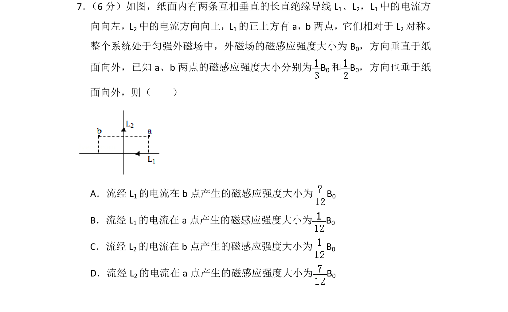
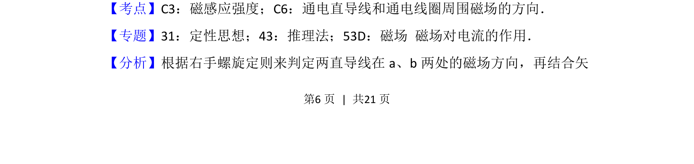
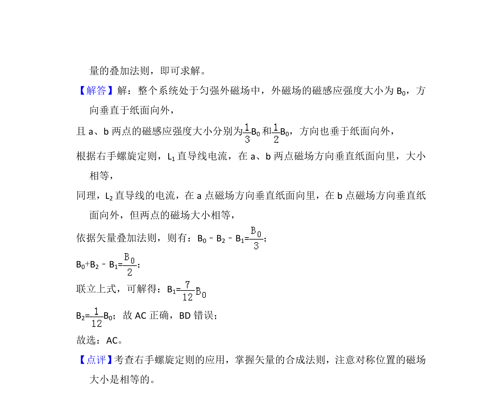

## 题面

## 摘要

考查通电直导线周围磁场叠加，结合右手定则分析空间磁感应强度矢量和。

## 关联考点

- [[323-磁感应强度|磁感应强度]]
- [[742-通电直导线磁场方向|通电直导线磁场方向]]
- [[702-矢量和|矢量和]]

## 答案与解析

> 📄 原 PDF 第 6 页：`素材/真题/吉林/2008-2024·（吉林）物理高考真题/2018年高考物理试卷（新课标Ⅱ）（解析卷）.pdf`

<!-- 题干文本-start -->
## 题干文本
7． （6分）如图，纸面内有两条互相垂直的长直绝缘导线L1、L2，L1中的电流方
向向左，L2中的电流方向向上，L1的正上方有a，b两点，它们相对于L 2对称。
整个系统处于匀强外磁场中，外磁场的磁感应强度大小为B 0，方向垂直于纸
面向外，已知a、b两点的磁感应强度大小分别为B 0和B 0，方向也垂于纸
面向外，则（　　）
A．流经L 1的电流在b点产生的磁感应强度大小为B 0
B．流经L 1的电流在a点产生的磁感应强度大小为B 0
C．流经L 2的电流在b点产生的磁感应强度大小为B 0
D．流经L 2的电流在a点产生的磁感应强度大小为B 0
<!-- 题干文本-end -->

<!-- 解析文本-start -->
## 解析文本
【考点】C3：磁感应强度；C6：通电直导线和通电线圈周围磁场的方向．菁优网版权所有
【专题】31：定性思想；43：推理法；53D：磁场 磁场对电流的作用．
【分析】根据右手螺旋定则来判定两直导线在a、b两处的磁场方向，再结合矢
<!-- 解析文本-end -->
