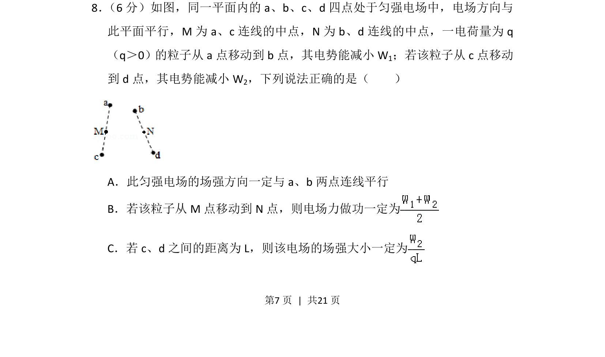

## 题面

## 摘要

考查匀强电场中电势能与电场力做功的关系，涉及几何中点与等势面分析。

## 关联考点

- [[276-电势能|电势能]]
- [[电场力做功]]
- [[252-匀强电场|匀强电场]]
- [[几何中点]]

## 答案与解析

> 📄 原 PDF 第 7 页：`素材/真题/吉林/2008-2024·（吉林）物理高考真题/2018年高考物理试卷（新课标Ⅱ）（解析卷）.pdf`
