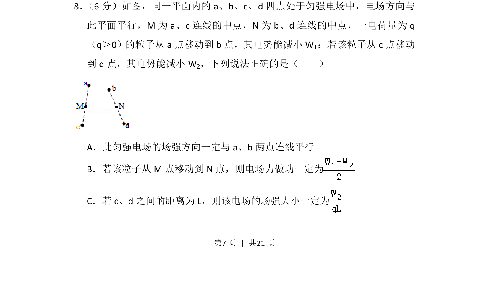
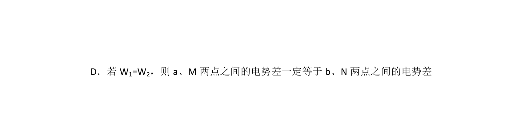
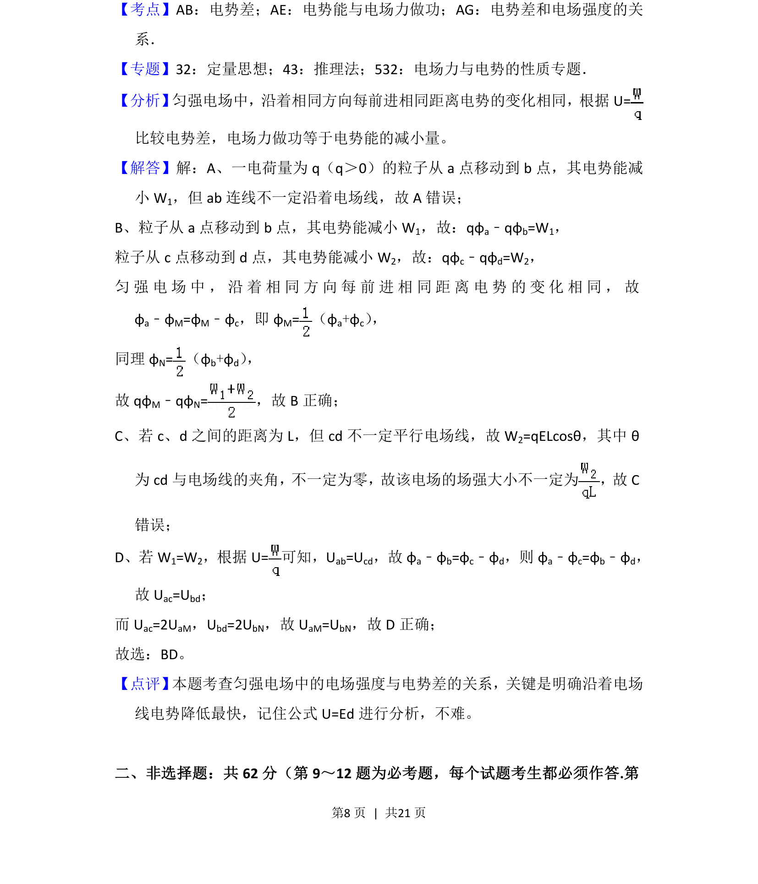

## 题面

## 摘要

考查匀强电场中电势能与电场力做功的关系，涉及几何中点与等势面分析。

## 关联考点

- [[276-电势能|电势能]]
- [[673-电场力做功|电场力做功]]
- [[252-匀强电场|匀强电场]]
- [[777-几何中点|几何中点]]

## 答案与解析

> 📄 原 PDF 第 7 页：`素材/真题/吉林/2008-2024·（吉林）物理高考真题/2018年高考物理试卷（新课标Ⅱ）（解析卷）.pdf`

<!-- 题干文本-start -->
## 题干文本
8． （6分）如图，同一平面内的a、b、c、d四点处于匀强电场中，电场方向与
此平面平行，M为a、c连线的中点，N为b、d连线的中点，一电荷量为q
（q＞0）的粒子从a点移动到b点，其电势能减小W 1；若该粒子从c点移动
到d点，其电势能减小W 2，下列说法正确的是（　　）
A．此匀强电场的场强方向一定与a、b两点连线平行
B．若该粒子从M点移动到N点，则电场力做功一定为
C．若c、d之间的距离为L，则该电场的场强大小一定为
<!-- 题干文本-end -->

<!-- 解析文本-start -->
## 解析文本

<!-- 解析文本-end -->
