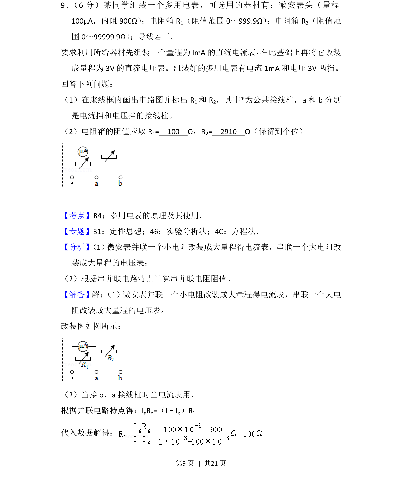
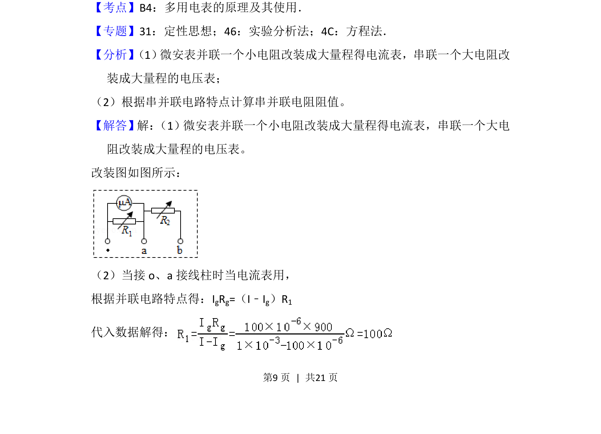
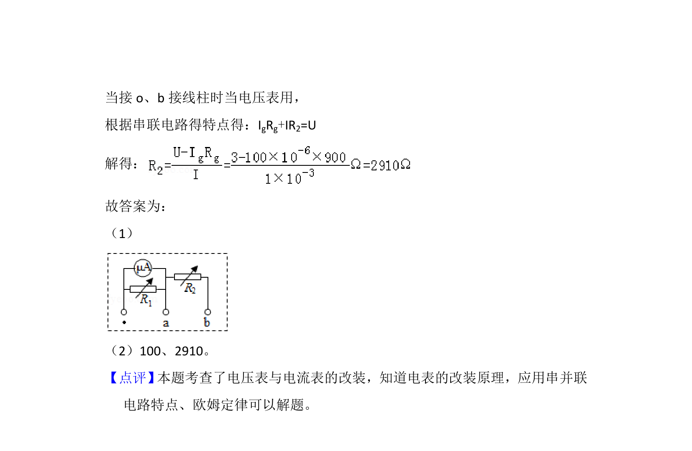

## 题面

## 摘要

本题要求设计多用电表的电流挡和电压挡电路，计算改装电阻值并画电路图。

## 关联考点

- [[690-电表改装|电表改装]]
- [[504-串并联电路|串并联电路]]
- [[141-欧姆定律-初中|欧姆定律]]

## 答案与解析

> 📄 原 PDF 第 9 页：`素材/真题/吉林/2008-2024·（吉林）物理高考真题/2018年高考物理试卷（新课标Ⅱ）（解析卷）.pdf`

<!-- 题干文本-start -->
## 题干文本
9． （6分）某同学组装一个多用电表，可选用的器材有：微安表头（量程
100μA，内阻900Ω） ；电阻箱R1（阻值范围0～999.9Ω） ；电阻箱R2（阻值范
围0～99999.9Ω） ；导线若干。
要求利用所给器材先组装一个量程为lmA的直流电流表， 在此基础上再将它改装
成量程为3V的直流电压表。组装好的多用电表有电流1mA和电压3V两挡。
回答下列问题：
（1）在虚线框内画出电路图并标出R 1和R 2，其中*为公共接线柱，a和b分別
是电流挡和电压挡的接线柱。
（2）电阻箱的阻值应取R 1=　100　Ω，R2=　2910　Ω（保留到个位）
<!-- 题干文本-end -->

<!-- 解析文本-start -->
## 解析文本
【考点】B4：多用电表的原理及其使用．菁优网版权所有
【专题】31：定性思想；46：实验分析法；4C：方程法．
【分析】 （1） 微安表并联一个小电阻改装成大量程得电流表，串联一个大电阻改
装成大量程的电压表；
（2）根据串并联电路特点计算串并联电阻阻值。
【解答】解： （1）微安表并联一个小电阻改装成大量程得电流表，串联一个大电
阻改装成大量程的电压表。
改装图如图所示：
（2）当接o、a接线柱时当电流表用，
根据并联电路特点得：IgRg=（I﹣Ig）R1
代入数据解得：
<!-- 解析文本-end -->
