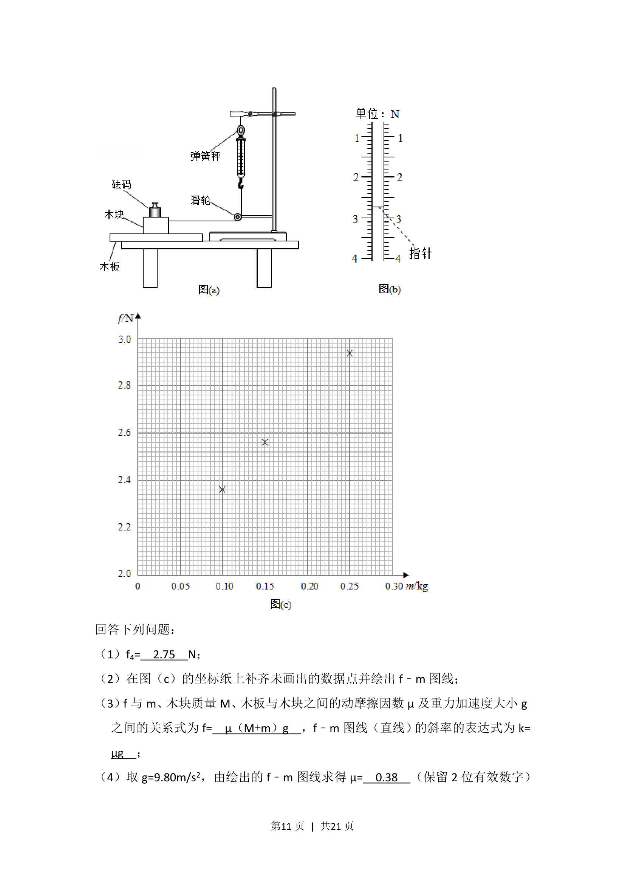
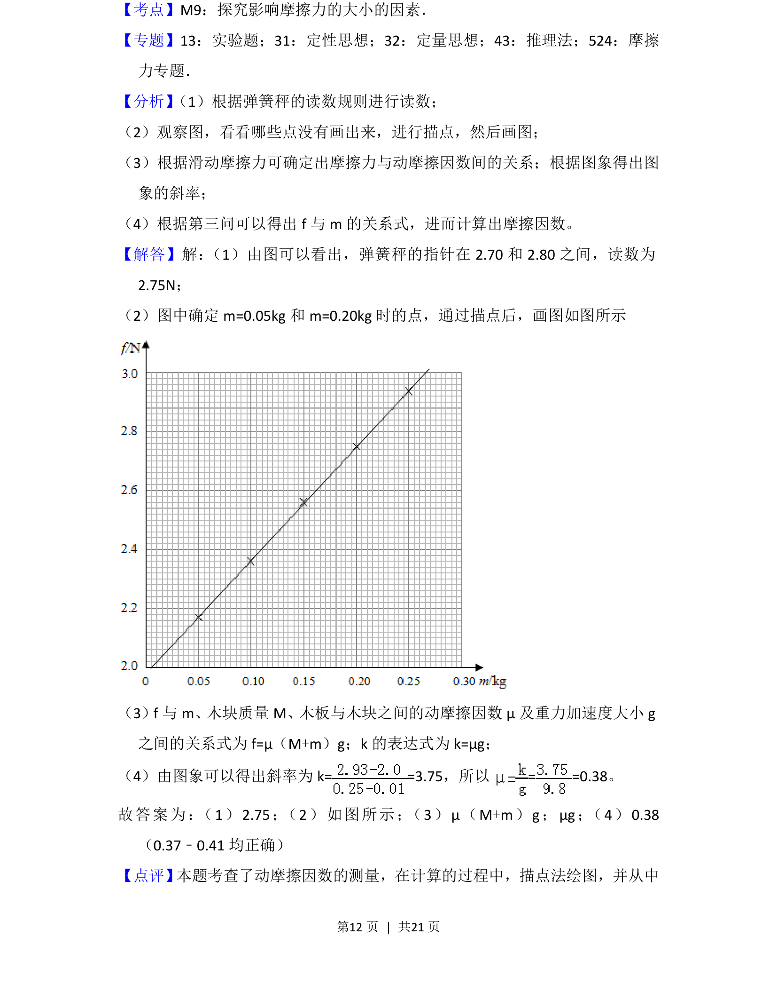
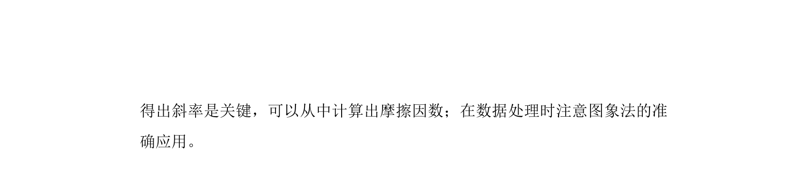

## 题面

## 摘要

测量木块与木板间动摩擦因数，利用二力平衡通过弹簧秤读数获取滑动摩擦力并处理数据。

## 关联考点

- [[097-滑动摩擦力|滑动摩擦力]]
- [[537-动摩擦因数|动摩擦因数]]
- [[533-力的平衡|力的平衡]]
- [[582-实验数据处理|实验数据处理]]

## 答案与解析

> 📄 原 PDF 第 10 页：`素材/真题/吉林/2008-2024·（吉林）物理高考真题/2018年高考物理试卷（新课标Ⅱ）（解析卷）.pdf`
