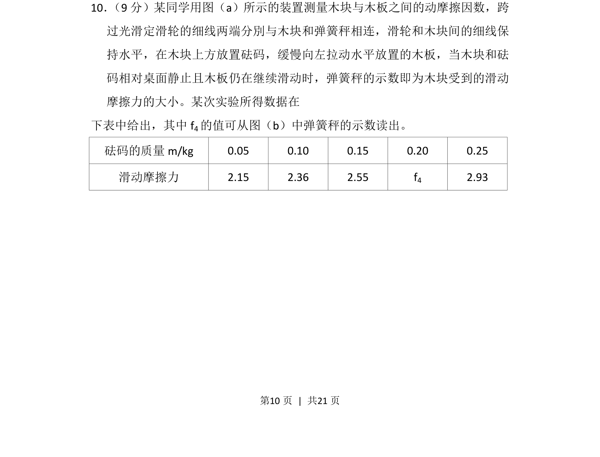
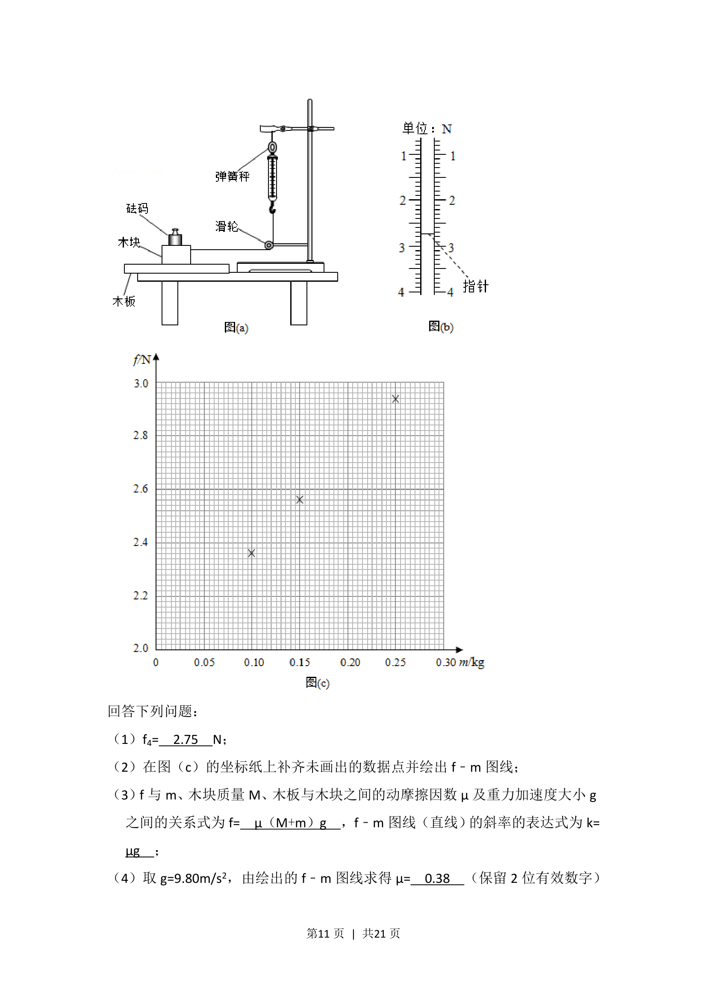
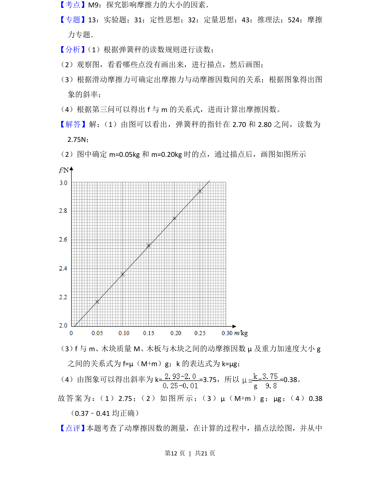
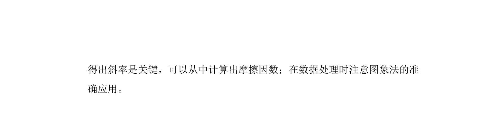

## 题面

## 摘要

测量木块与木板间动摩擦因数，利用二力平衡通过弹簧秤读数获取滑动摩擦力并处理数据。

## 关联考点

- [[097-滑动摩擦力|滑动摩擦力]]
- [[537-动摩擦因数|动摩擦因数]]
- [[533-力的平衡|力的平衡]]
- [[582-实验数据处理|实验数据处理]]

## 答案与解析

> 📄 原 PDF 第 10 页：`素材/真题/吉林/2008-2024·（吉林）物理高考真题/2018年高考物理试卷（新课标Ⅱ）（解析卷）.pdf`

<!-- 题干文本-start -->
## 题干文本
10． （9分）某同学用图（a）所示的装置测量木块与木板之间的动摩擦因数，跨
过光滑定滑轮的细线两端分別与木块和弹簧秤相连，滑轮和木块间的细线保
持水平，在木块上方放置砝码，缓慢向左拉动水平放置的木板，当木块和砝
码相对桌面静止且木板仍在继续滑动时，弹簧秤的示数即为木块受到的滑动
摩擦力的大小。某次实验所得数据在
下表中给出，其中f 4的值可从图（b）中弹簧秤的示数读出。 
砝码的质量m/kg 0.05 0.10 0.15 0.20 0.25
滑动摩擦力 2.15 2.36 2.55 f4 2.93
<!-- 题干文本-end -->

<!-- 解析文本-start -->
## 解析文本

<!-- 解析文本-end -->
