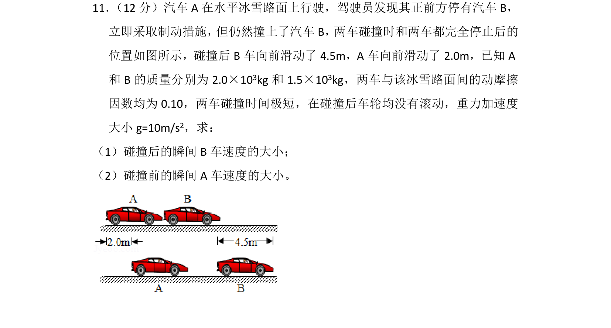
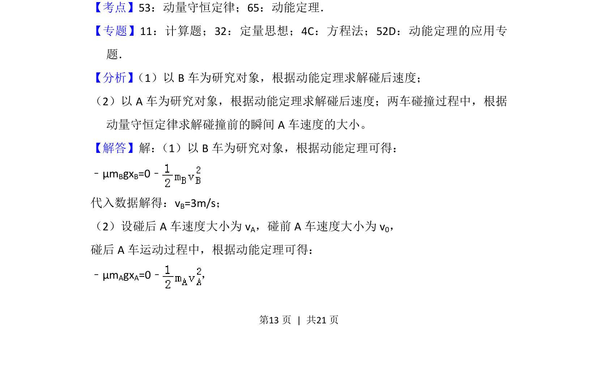
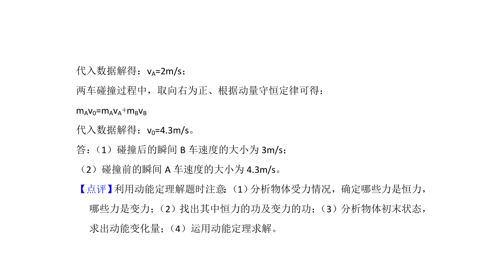

## 题面

## 摘要

两车碰撞后滑行距离求碰后速度，再结合动量守恒求碰前速度。

## 关联考点

- [[347-动量守恒定律|动量守恒定律]]
- [[251-动能定理|动能定理]]

## 答案与解析

> 📄 原 PDF 第 13 页：`素材/真题/吉林/2008-2024·（吉林）物理高考真题/2018年高考物理试卷（新课标Ⅱ）（解析卷）.pdf`

<!-- 题干文本-start -->
## 题干文本
11． （12分）汽车A在水平冰雪路面上行驶，驾驶员发现其正前方停有汽车B，
立即采取制动措施， 但仍然撞上了汽车B， 两车碰撞时和两车都完全停止后的
位置如图所示，碰撞后B车向前滑动了4.5m，A车向前滑动了2.0m，已知A
和B的质量分别为2.0×10 3kg和1.5×10 3kg，两车与该冰雪路面间的动摩擦
因数均为0.10，两车碰撞时间极短，在碰撞后车轮均没有滚动，重力加速度
大小g=10m/s 2，求：
（1）碰撞后的瞬间B车速度的大小；
（2）碰撞前的瞬间A车速度的大小。
<!-- 题干文本-end -->

<!-- 解析文本-start -->
## 解析文本
【考点】53：动量守恒定律；65：动能定理．菁优网版权所有
【专题】11：计算题；32：定量思想；4C：方程法；52D：动能定理的应用专
题．
【分析】 （1）以B车为研究对象，根据动能定理求解碰后速度；
（2）以A车为研究对象，根据动能定理求解碰后速度；两车碰撞过程中，根据
动量守恒定律求解碰撞前的瞬间A车速度的大小。
【解答】解： （1）以B车为研究对象，根据动能定理可得：
﹣μmBgxB=0﹣
代入数据解得：vB=3m/s；
（2）设碰后A车速度大小为v A，碰前A车速度大小为v 0，
碰后A车运动过程中，根据动能定理可得：
﹣μmAgxA=0﹣，
<!-- 解析文本-end -->
