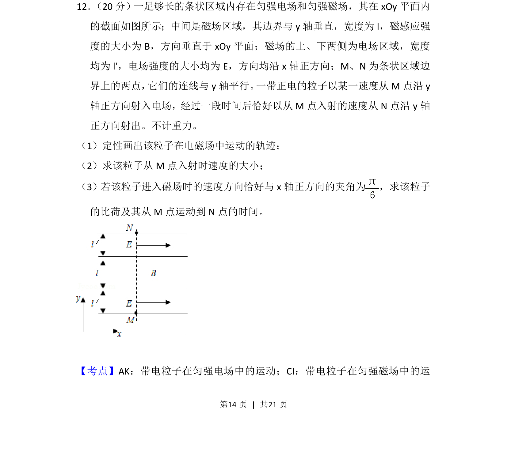
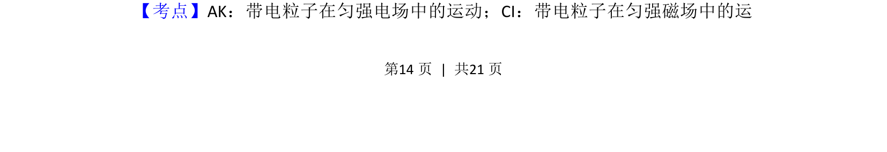
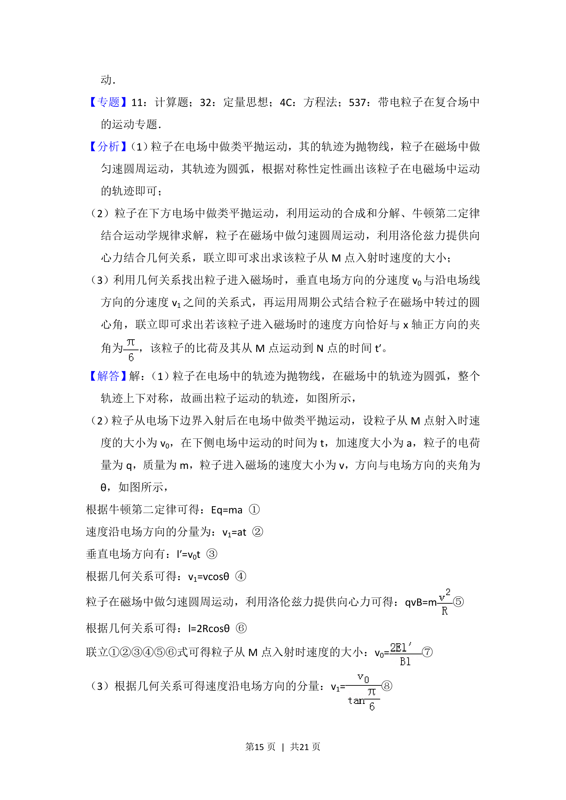
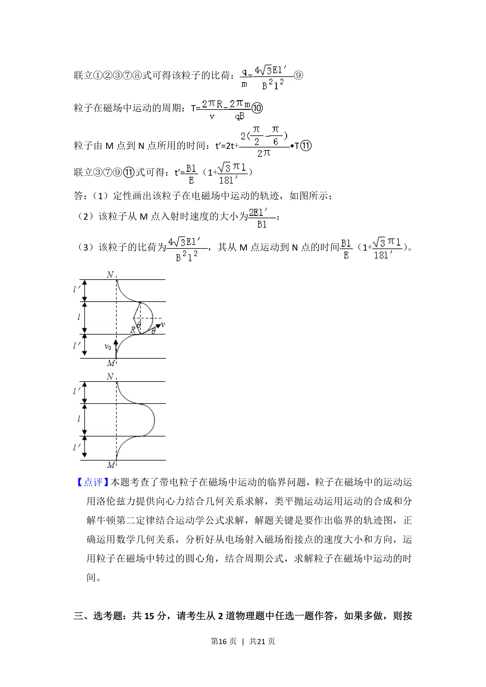

## 题面

## 摘要

该题考查带电粒子在组合匀强电场和磁场中的运动轨迹、入射速度及比荷与运动时间的综合计算。

## 关联考点

- [[轨迹作图]]
- [[速度合成与分解]]
- [[270-三角函数应用|三角函数]]
- [[周期公式]]

## 答案与解析

> 📄 原 PDF 第 14 页：`素材/真题/吉林/2008-2024·（吉林）物理高考真题/2018年高考物理试卷（新课标Ⅱ）（解析卷）.pdf`
