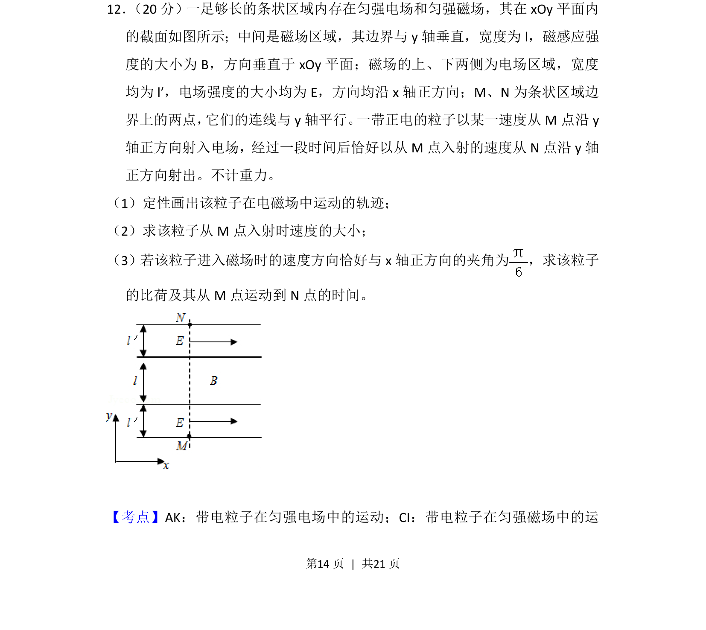
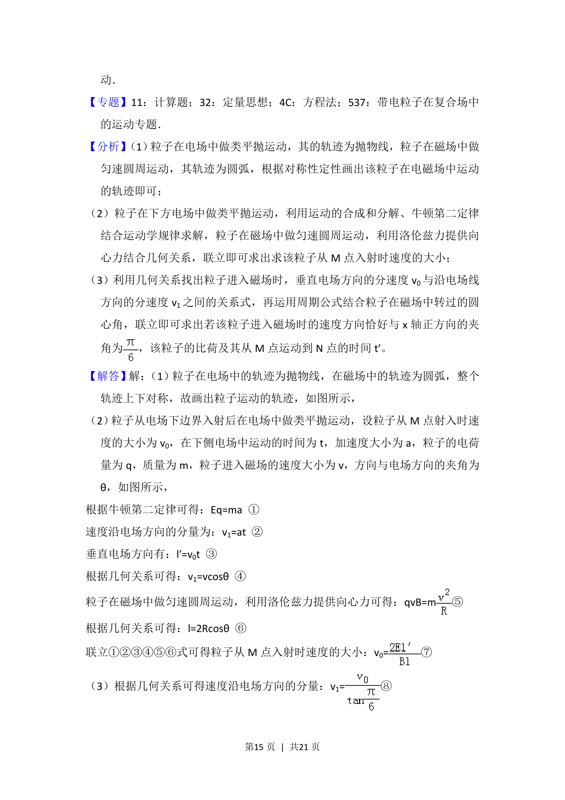
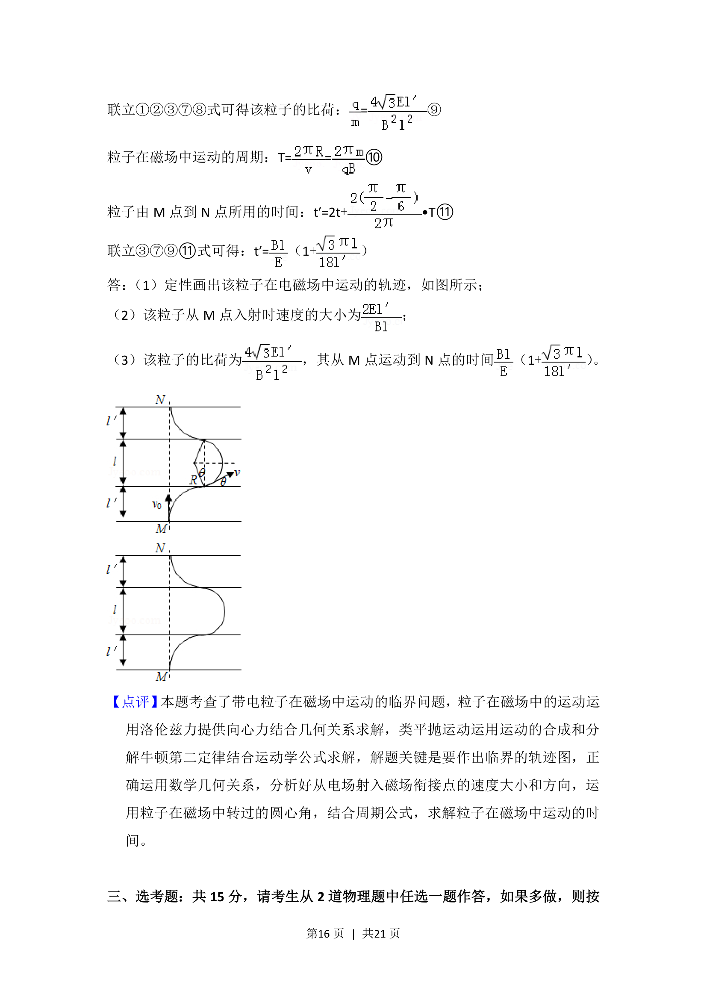

## 题面

## 摘要

带电粒子在匀强电场和磁场组合场中的运动，涉及轨迹分析、速度求解及比荷与时间计算。

## 关联考点

- [[468-带电粒子在匀强电场中的运动|带电粒子在匀强电场中的运动]]
- [[595-带电粒子在匀强磁场中的运动|带电粒子在匀强磁场中的运动]]

## 答案与解析

> 📄 原 PDF 第 14 页：`素材/真题/吉林/2008-2024·（吉林）物理高考真题/2018年高考物理试卷（新课标Ⅱ）（解析卷）.pdf`

<!-- 题干文本-start -->
## 题干文本
12． （20分）一足够长的条状区域内存在匀强电场和匀强磁场，其在xOy平面内
的截面如图所示；中间是磁场区域，其边界与y轴垂直，宽度为l，磁感应强
度的大小为B，方向垂直于xOy平面；磁场的上、下两侧为电场区域，宽度
均为l′，电场强度的大小均为E，方向均沿x轴正方向；M、N为条状区域边
界上的两点， 它们的连线与y轴平行。 一带正电的粒子以某一速度从M点沿y
轴正方向射入电场，经过一段时间后恰好以从M点入射的速度从N点沿y轴
正方向射出。不计重力。
（1）定性画出该粒子在电磁场中运动的轨迹；
（2）求该粒子从M点入射时速度的大小；
（3）若该粒子进入磁场时的速度方向恰好与x轴正方向的夹角为 ，求该粒子
的比荷及其从M点运动到N点的时间。
<!-- 题干文本-end -->

<!-- 解析文本-start -->
## 解析文本
【考点】AK：带电粒子在匀强电场中的运动；CI：带电粒子在匀强磁场中的运
<!-- 解析文本-end -->
