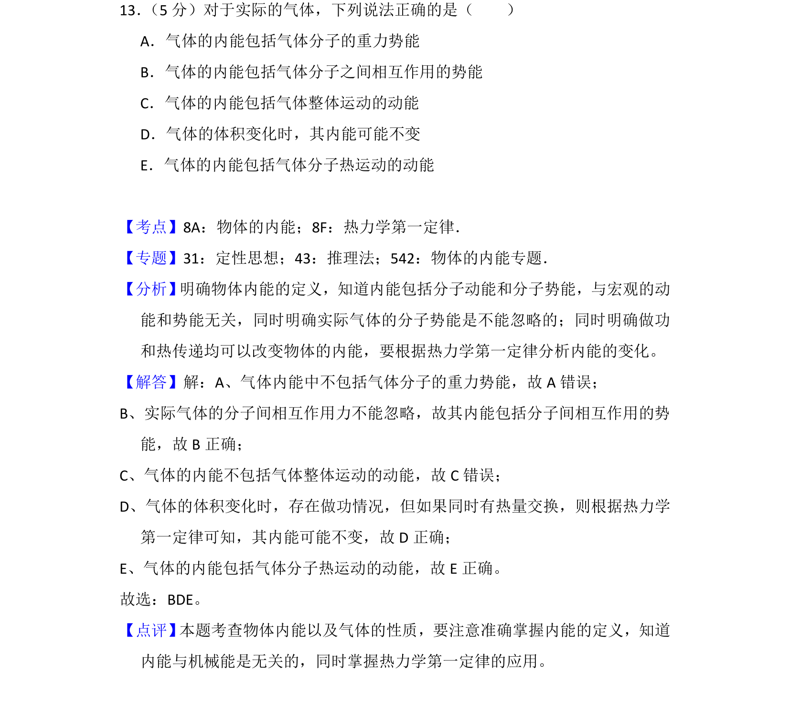
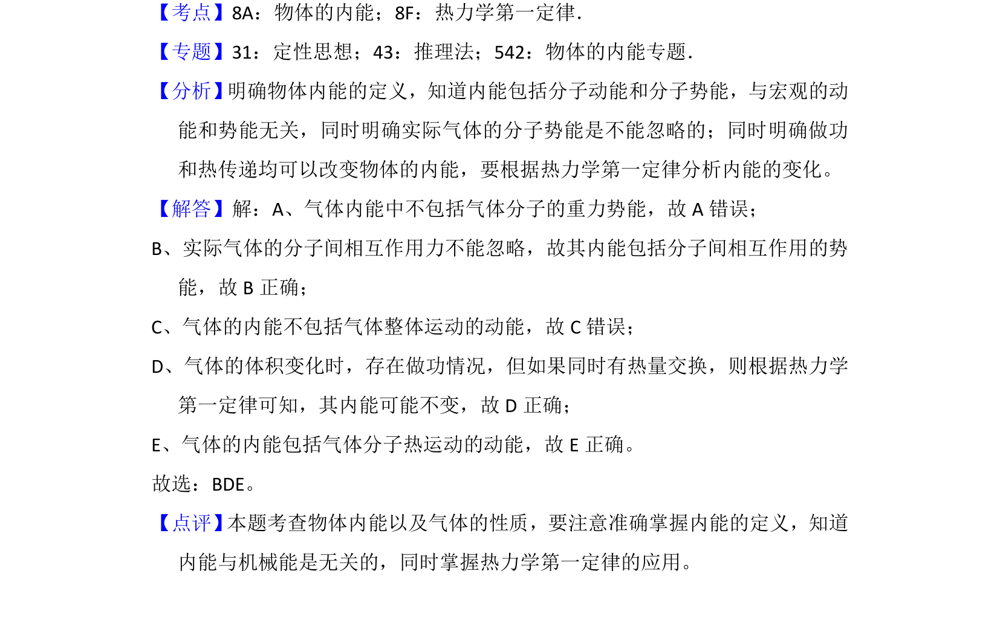

## 题面

## 摘要

本题通过辨析实际气体的内能组成及变化，考查对物体内能概念与热力学第一定律的理解。

## 关联考点

- [[664-物体的内能|物体的内能]]
- [[440-热力学第一定律|热力学第一定律]]

## 答案与解析

> 📄 原 PDF 第 17 页：`素材/真题/吉林/2008-2024·（吉林）物理高考真题/2018年高考物理试卷（新课标Ⅱ）（解析卷）.pdf`

<!-- 题干文本-start -->
## 题干文本
13． （5分）对于实际的气体，下列说法正确的是（　　）
A．气体的内能包括气体分子的重力势能
B．气体的内能包括气体分子之间相互作用的势能
C．气体的内能包括气体整体运动的动能
D．气体的体积变化时，其内能可能不变
E．气体的内能包括气体分子热运动的动能
<!-- 题干文本-end -->

<!-- 解析文本-start -->
## 解析文本
【考点】8A：物体的内能；8F：热力学第一定律．菁优网版权所有
【专题】31：定性思想；43：推理法；542：物体的内能专题．
【分析】 明确物体内能的定义，知道内能包括分子动能和分子势能，与宏观的动
能和势能无关，同时明确实际气体的分子势能是不能忽略的；同时明确做功
和热传递均可以改变物体的内能，要根据热力学第一定律分析内能的变化。
【解答】解：A、气体内能中不包括气体分子的重力势能，故A错误；
B、实际气体的分子间相互作用力不能忽略，故其内能包括分子间相互作用的势
能，故B正确；
C、气体的内能不包括气体整体运动的动能，故C错误；
D、气体的体积变化时，存在做功情况，但如果同时有热量交换，则根据热力学
第一定律可知，其内能可能不变，故D正确；
E、气体的内能包括气体分子热运动的动能，故E正确。
故选：BDE。
【点评】 本题考查物体内能以及气体的性质，要注意准确掌握内能的定义，知道
内能与机械能是无关的，同时掌握热力学第一定律的应用。
<!-- 解析文本-end -->
