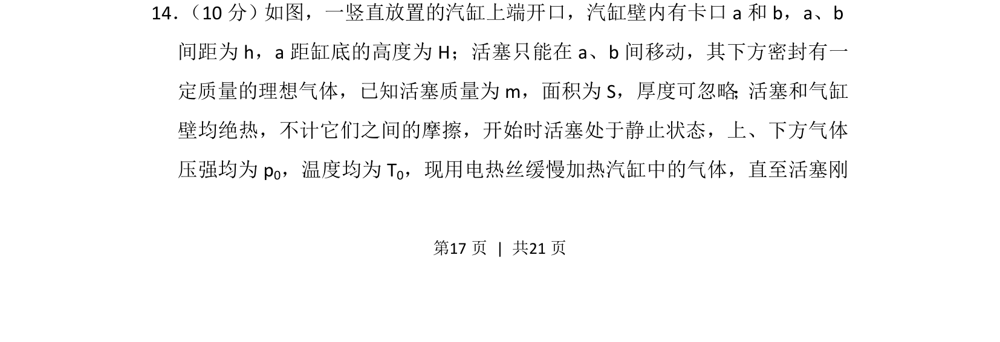
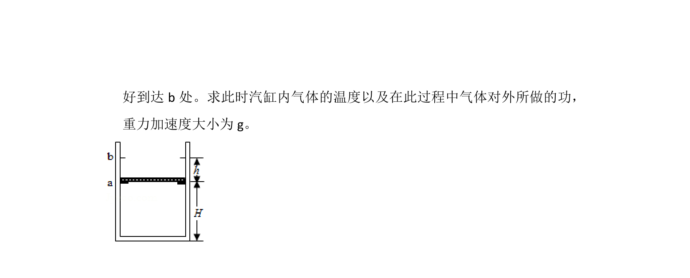
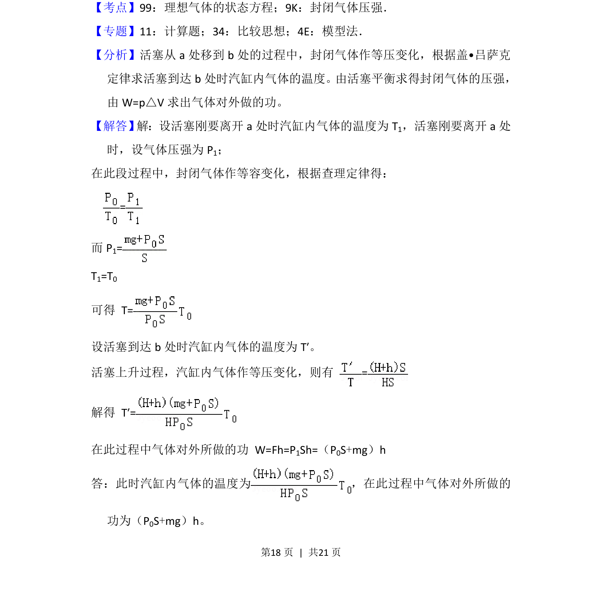
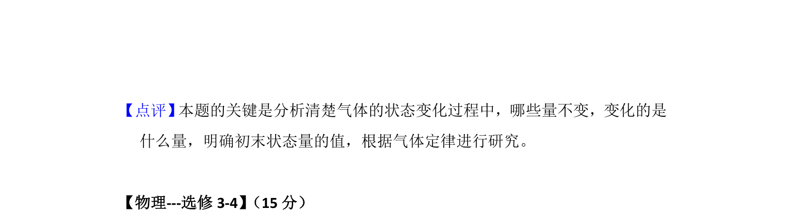

## 题面

## 摘要

理想气体状态方程与力学平衡的综合应用，涉及等压过程与临界状态分析。

## 关联考点

- [[446-理想气体状态方程|理想气体状态方程]]
- [[554-受力平衡|受力平衡]]
- [[430-查理定律|等容变化]]
- [[447-盖吕萨克定律|等压变化]]

## 答案与解析

> 📄 原 PDF 第 17 页：`素材/真题/吉林/2008-2024·（吉林）物理高考真题/2018年高考物理试卷（新课标Ⅱ）（解析卷）.pdf`
