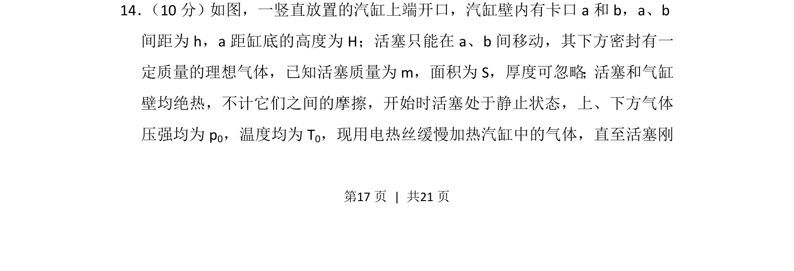
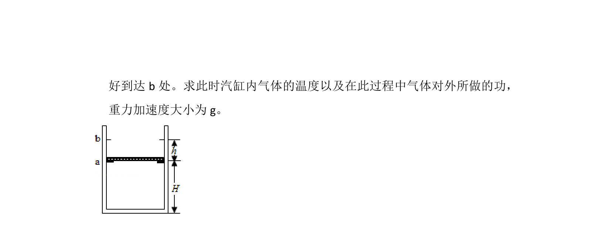
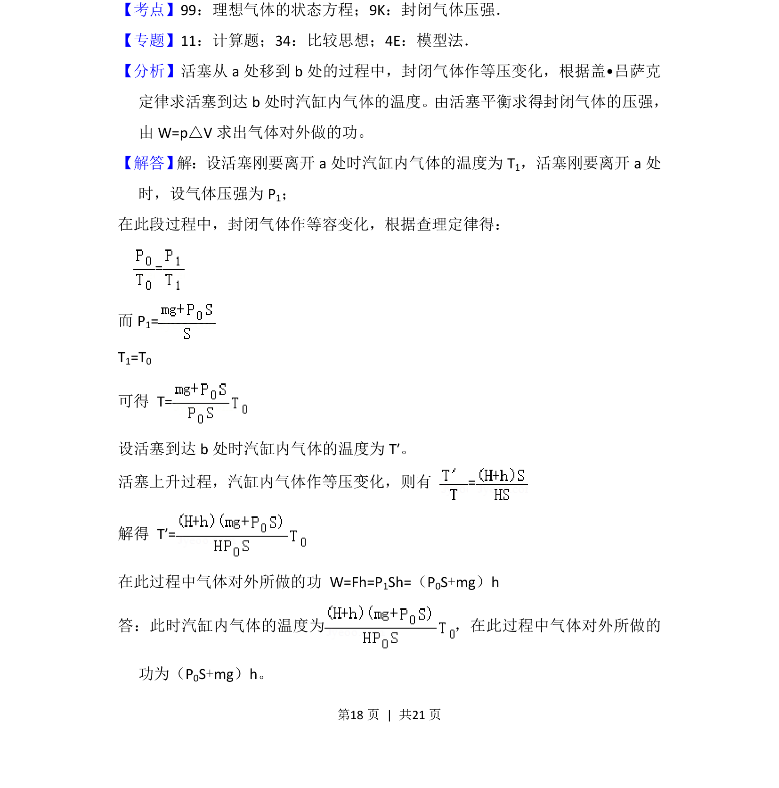
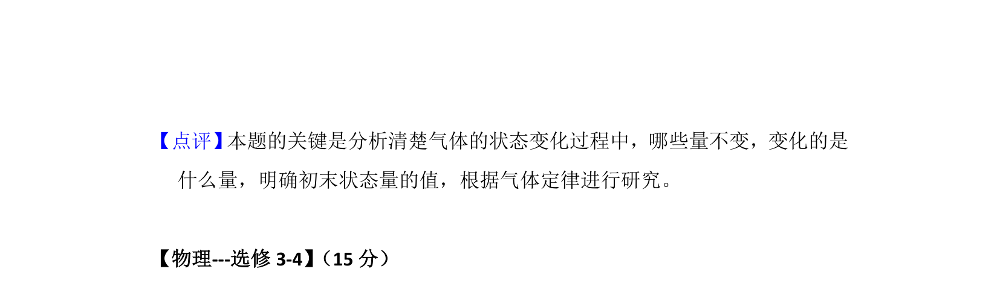

## 题面

## 摘要

理想气体状态方程与力学平衡的综合应用，涉及等压过程与临界状态分析。

## 关联考点

- [[446-理想气体状态方程|理想气体状态方程]]
- [[554-受力平衡|受力平衡]]
- [[430-查理定律|等容变化]]
- [[447-盖吕萨克定律|等压变化]]

## 答案与解析

> 📄 原 PDF 第 17 页：`素材/真题/吉林/2008-2024·（吉林）物理高考真题/2018年高考物理试卷（新课标Ⅱ）（解析卷）.pdf`

<!-- 题干文本-start -->
## 题干文本
14． （10分）如图，一竖直放置的汽缸上端开口，汽缸壁内有卡口a和b，a、b
间距为h，a距缸底的高度为H；活塞只能在a、b间移动，其下方密封有一
定质量的理想气体，已知活塞质量为m，面积为S，厚度可忽略；活塞和气缸
壁均绝热，不计它们之间的摩擦，开始时活塞处于静止状态，上、下方气体
压强均为p 0，温度均为T 0，现用电热丝缓慢加热汽缸中的气体，直至活塞刚
<!-- 题干文本-end -->

<!-- 解析文本-start -->
## 解析文本

<!-- 解析文本-end -->
