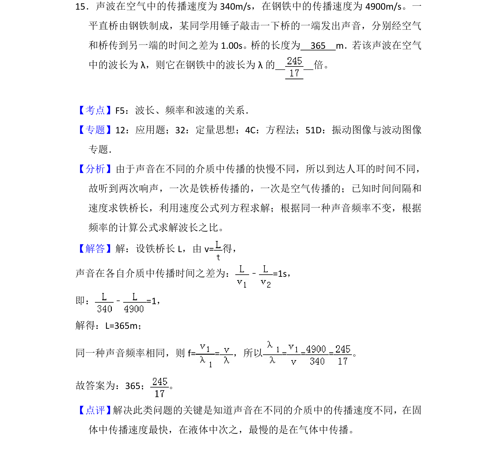
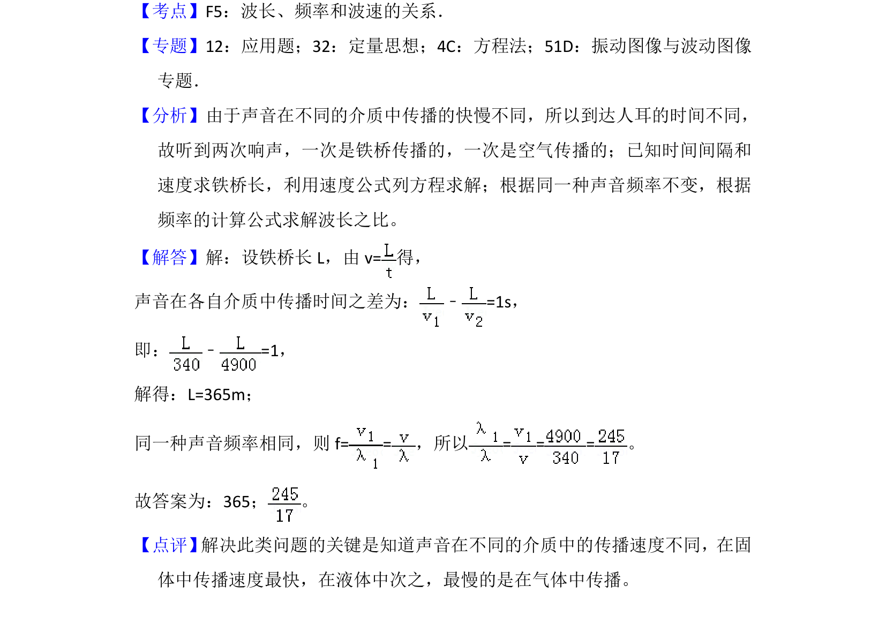

## 题面

## 摘要

该题考查声波在不同介质中传播的速度、时间差、波长与频率的关系及计算。

## 关联考点

- [[370-波长|波长]]
- [[143-频数分布|频率]]
- [[369-波速|波速]]

## 答案与解析

> 📄 原 PDF 第 19 页：`素材/真题/吉林/2008-2024·（吉林）物理高考真题/2018年高考物理试卷（新课标Ⅱ）（解析卷）.pdf`

<!-- 题干文本-start -->
## 题干文本
15．声波在空气中的传播速度为340m/s，在钢铁中的传播速度为4900m/s。一
平直桥由钢铁制成，某同学用锤子敲击一下桥的一端发出声音，分别经空气
和桥传到另一端的时间之差为1.00s。桥的长度为　365　m．若该声波在空气
中的波长为λ，则它在钢铁中的波长为λ的　 　倍。
<!-- 题干文本-end -->

<!-- 解析文本-start -->
## 解析文本
【考点】F5：波长、频率和波速的关系．菁优网版权所有
【专题】12：应用题；32：定量思想；4C：方程法；51D：振动图像与波动图像
专题．
【分析】由于声音在不同的介质中传播的快慢不同，所以到达人耳的时间不同，
故听到两次响声，一次是铁桥传播的，一次是空气传播的；已知时间间隔和
速度求铁桥长，利用速度公式列方程求解；根据同一种声音频率不变，根据
频率的计算公式求解波长之比。
【解答】解：设铁桥长L，由v=得，
声音在各自介质中传播时间之差为：﹣=1s，
即：﹣=1，
解得：L=365m；
同一种声音频率相同，则f= =，所以= = =。
故答案为：365； 。
【点评】 解决此类问题的关键是知道声音在不同的介质中的传播速度不同，在固
体中传播速度最快，在液体中次之，最慢的是在气体中传播。
<!-- 解析文本-end -->
