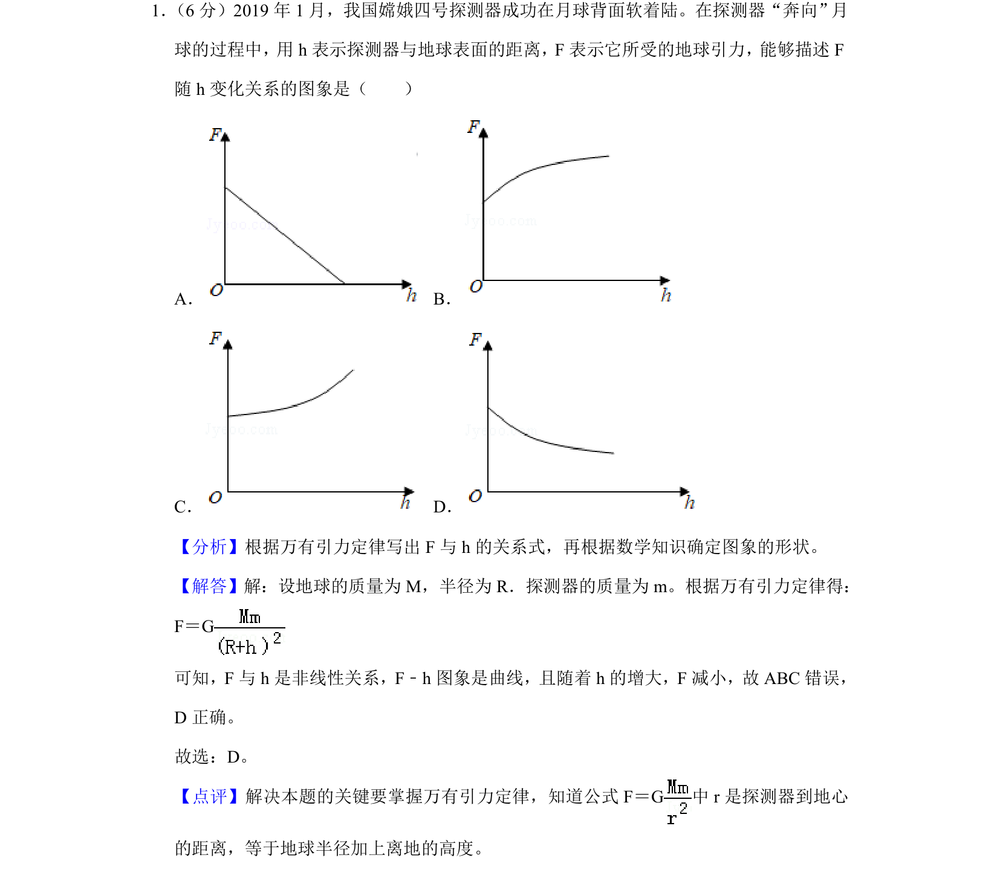
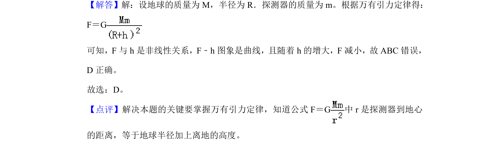

## 题面

## 摘要

该题考查万有引力定律中探测器所受引力F与离地高度h的非线性关系及图像识别。

## 关联考点

- [[246-万有引力定律|万有引力定律]]
- [[526-函数图像识别|函数图像识别]]

## 答案与解析

> 📄 原 PDF 第 1 页：`素材/真题/吉林/2008-2024·（吉林）物理高考真题/2019年高考物理试卷（新课标Ⅱ）（解析卷）.pdf`

<!-- 题干文本-start -->
## 题干文本
1． （6分）2019年1月，我国嫦娥四号探测器成功在月球背面软着陆。在探测器“奔向”月
球的过程中，用h表示探测器与地球表面的距离，F表示它所受的地球引力，能够描述F
随h变化关系的图象是（　　）
A．B．
C．D．
<!-- 题干文本-end -->

<!-- 解析文本-start -->
## 解析文本
【分析】根据万有引力定律写出F与h的关系式，再根据数学知识确定图象的形状。
【解答】解：设地球的质量为M，半径为R．探测器的质量为m。根据万有引力定律得：
F＝G
可知，F与h是非线性关系，F﹣h图象是曲线，且随着h的增大，F减小，故ABC错误，
D正确。
故选：D。
【点评】解决本题的关键要掌握万有引力定律，知道公式F＝G中r是探测器到地心
的距离，等于地球半径加上离地的高度。
<!-- 解析文本-end -->
