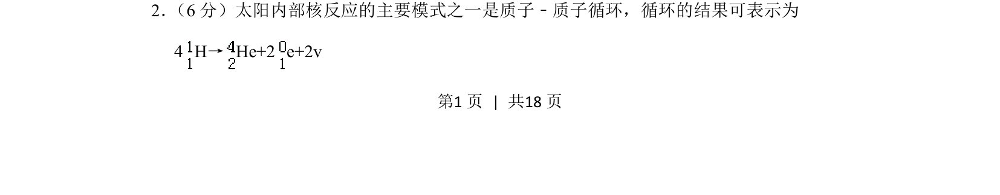
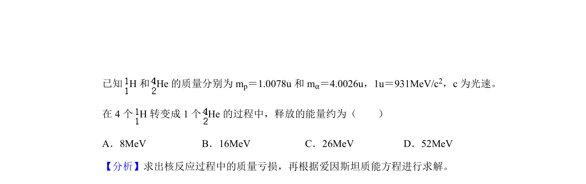
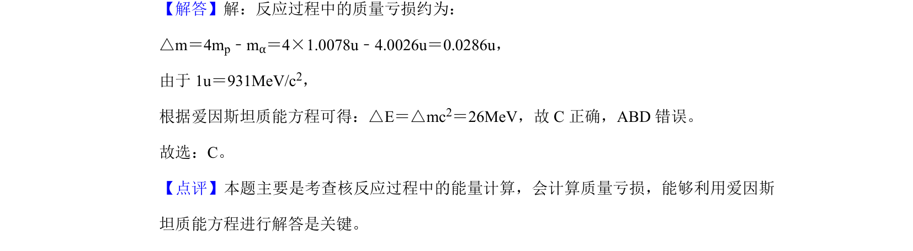

## 题面

## 摘要

该题考查核反应方程中质量数与电荷数守恒的简单计算。

## 关联考点

- [[728-质量数守恒|质量数守恒]]
- [[689-电荷数守恒|电荷数守恒]]
- [[622-方程平衡|方程平衡]]

## 答案与解析

> 📄 原 PDF 第 1 页：`素材/真题/吉林/2008-2024·（吉林）物理高考真题/2019年高考物理试卷（新课标Ⅱ）（解析卷）.pdf`
