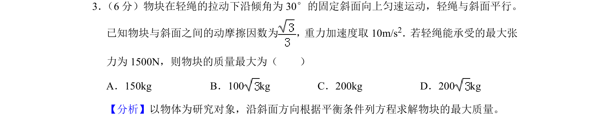
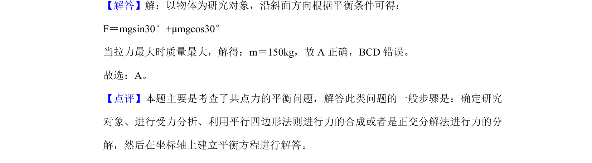

## 题面

## 摘要

物块沿斜面匀速运动，根据共点力平衡条件求解最大质量。

## 关联考点

- [[208-共点力平衡|共点力平衡]]
- [[097-滑动摩擦力|滑动摩擦力]]
- [[337-平面向量正交分解|正交分解]]

## 答案与解析

> 📄 原 PDF 第 2 页：`素材/真题/吉林/2008-2024·（吉林）物理高考真题/2019年高考物理试卷（新课标Ⅱ）（解析卷）.pdf`
