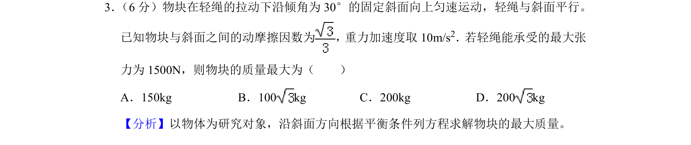
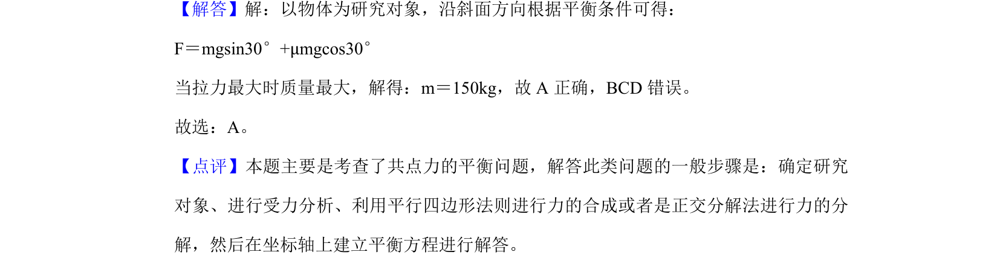

## 题面

## 摘要

物块沿斜面匀速运动，根据共点力平衡条件求解最大质量。

## 关联考点

- [[208-共点力平衡|共点力平衡]]
- [[097-滑动摩擦力|滑动摩擦力]]
- [[337-平面向量正交分解|正交分解]]

## 答案与解析

> 📄 原 PDF 第 2 页：`素材/真题/吉林/2008-2024·（吉林）物理高考真题/2019年高考物理试卷（新课标Ⅱ）（解析卷）.pdf`

<!-- 题干文本-start -->
## 题干文本
3． （6分）物块在轻绳的拉动下沿倾角为30°的固定斜面向上匀速运动，轻绳与斜面平行。
已知物块与斜面之间的动摩擦因数为 ，重力加速度取10m/s 2．若轻绳能承受的最大张
力为1500N，则物块的质量最大为（　　）
A．150kg B．100 kg C．200kg D．200 kg
<!-- 题干文本-end -->

<!-- 解析文本-start -->
## 解析文本
【分析】以物体为研究对象，沿斜面方向根据平衡条件列方程求解物块的最大质量。
【解答】解：以物体为研究对象，沿斜面方向根据平衡条件可得：
F＝mgsin30°+μmgcos30°
当拉力最大时质量最大，解得：m＝150kg，故A正确，BCD错误。
故选：A。
【点评】本题主要是考查了共点力的平衡问题，解答此类问题的一般步骤是：确定研究
对象、进行受力分析、利用平行四边形法则进行力的合成或者是正交分解法进行力的分
解，然后在坐标轴上建立平衡方程进行解答。
<!-- 解析文本-end -->
