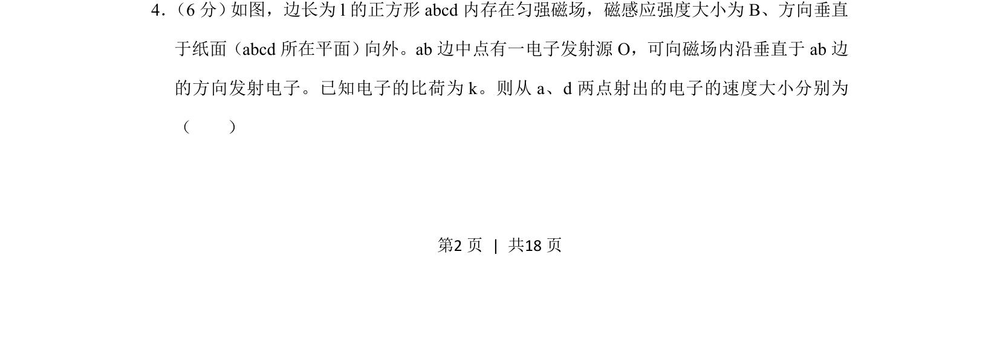
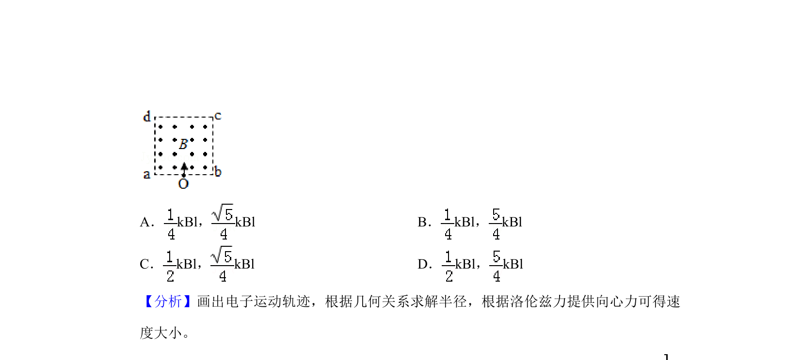
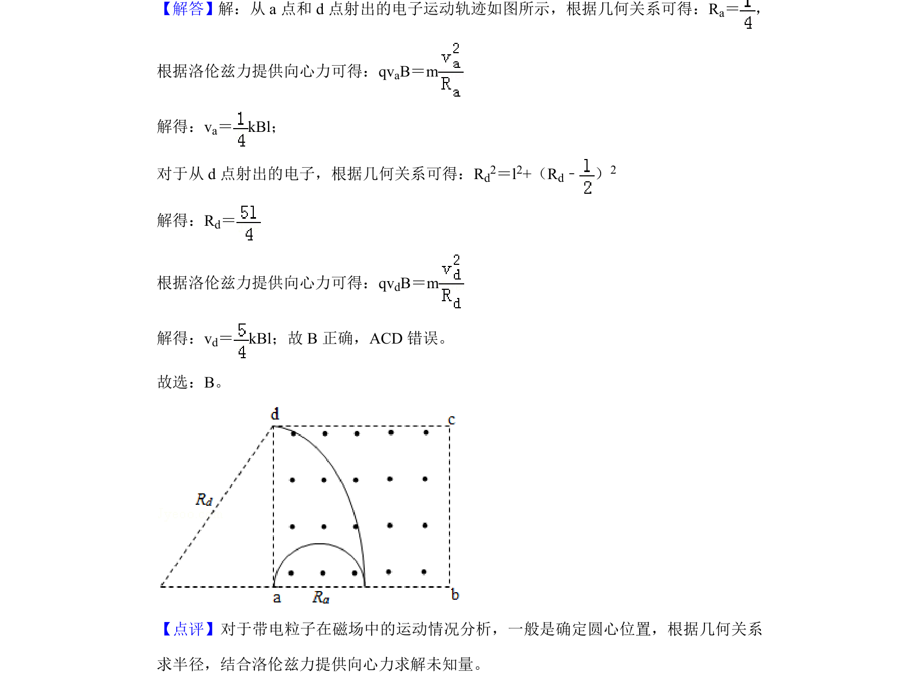

## 题面

## 摘要

求解电子在匀强磁场中做圆周运动从a、d点射出的速度大小。

## 关联考点

- [[598-带电粒子在磁场中的圆周运动|带电粒子在磁场中的圆周运动]]
- [[456-几何关系|几何关系]]
- [[649-洛伦兹力提供向心力|洛伦兹力提供向心力]]

## 答案与解析

> 📄 原 PDF 第 2 页：`素材/真题/吉林/2008-2024·（吉林）物理高考真题/2019年高考物理试卷（新课标Ⅱ）（解析卷）.pdf`
