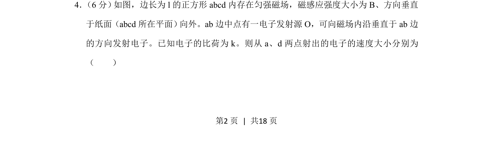
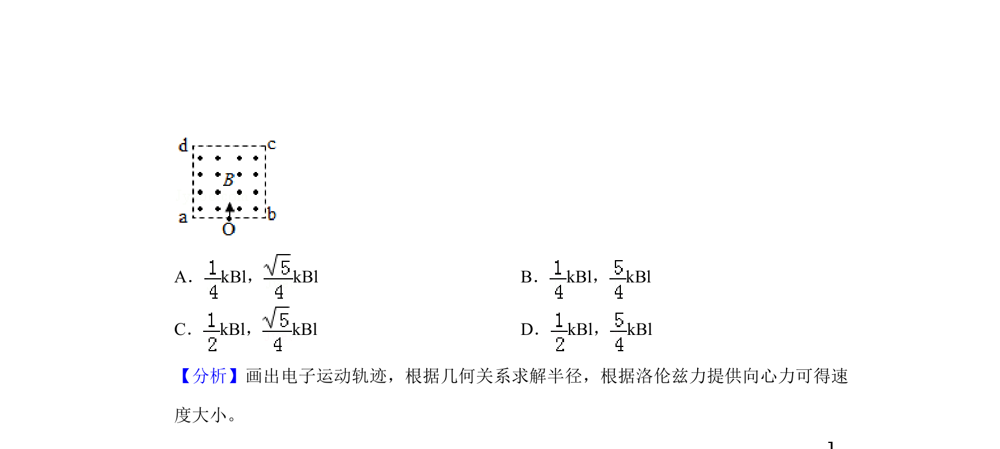
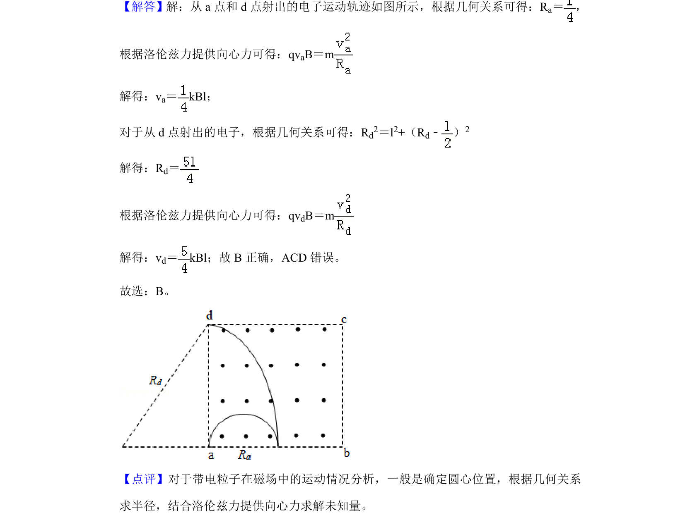

## 题面

## 摘要

求解电子在匀强磁场中做圆周运动从a、d点射出的速度大小。

## 关联考点

- [[301-带电粒子在磁场中圆周运动|带电粒子在磁场中的圆周运动]]
- [[456-几何关系|几何关系]]
- [[649-洛伦兹力提供向心力|洛伦兹力提供向心力]]

## 答案与解析

> 📄 原 PDF 第 2 页：`素材/真题/吉林/2008-2024·（吉林）物理高考真题/2019年高考物理试卷（新课标Ⅱ）（解析卷）.pdf`

<!-- 题干文本-start -->
## 题干文本
4． （6分） 如图，边长为l的正方形abcd内存在匀强磁场，磁感应强度大小为B、方向垂直
于纸面（abcd所在平面） 向外。ab边中点有一电子发射源O，可向磁场内沿垂直于ab边
的方向发射电子。已知电子的比荷为k。则从a、d两点射出的电子的速度大小分别为
（　　）
<!-- 题干文本-end -->

<!-- 解析文本-start -->
## 解析文本

<!-- 解析文本-end -->
