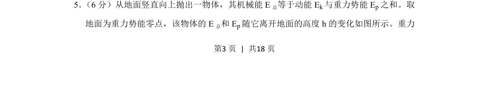
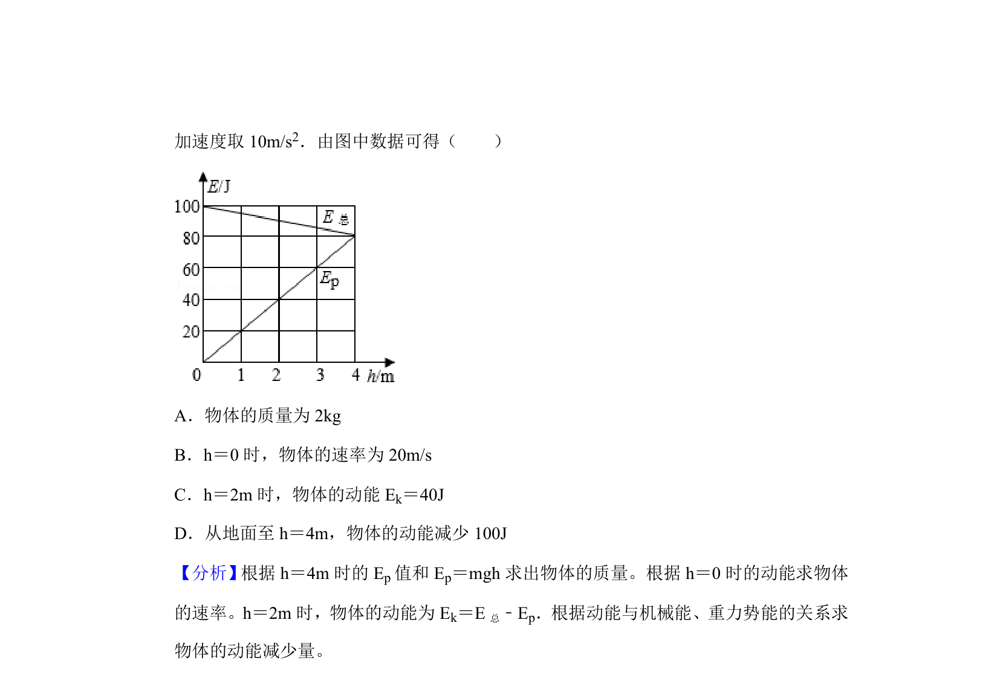
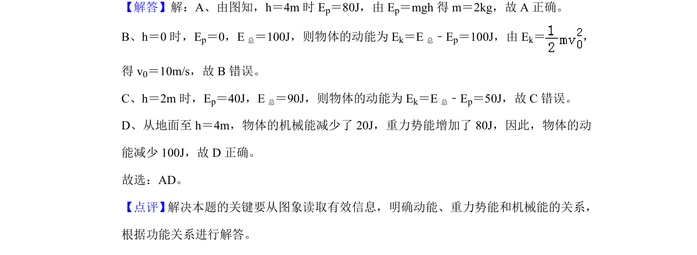

## 题面

## 摘要

该题通过竖直上抛物体的机械能与势能随高度变化图像，考查机械能守恒及动能、势能关系计算。

## 关联考点

- [[085-机械能守恒-初中|机械能守恒定律]]
- [[116-重力势能|重力势能]]
- [[249-功能关系|功能关系]]
- [[图像分析]]

## 答案与解析

> 📄 原 PDF 第 3 页：`素材/真题/吉林/2008-2024·（吉林）物理高考真题/2019年高考物理试卷（新课标Ⅱ）（解析卷）.pdf`
