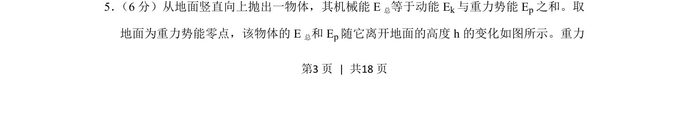
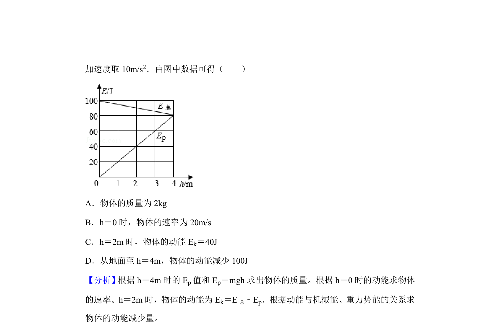
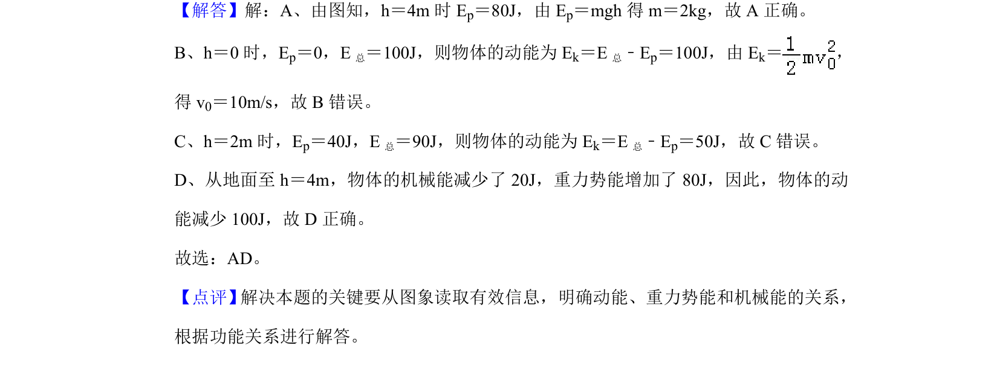

## 题面

## 摘要

该题通过竖直上抛物体的机械能与势能随高度变化图像，考查机械能守恒及动能、势能关系计算。

## 关联考点

- [[085-机械能守恒-初中|机械能守恒定律]]
- [[116-重力势能|重力势能]]
- [[249-功能关系|功能关系]]
- [[564-图像分析|图像分析]]

## 答案与解析

> 📄 原 PDF 第 3 页：`素材/真题/吉林/2008-2024·（吉林）物理高考真题/2019年高考物理试卷（新课标Ⅱ）（解析卷）.pdf`

<!-- 题干文本-start -->
## 题干文本
5． （6分）从地面竖直向上抛出一物体，其机械能E总等于动能E k与重力势能E p之和。取
地面为重力势能零点，该物体的E 总和E p随它离开地面的高度h的变化如图所示。重力
<!-- 题干文本-end -->

<!-- 解析文本-start -->
## 解析文本

<!-- 解析文本-end -->
