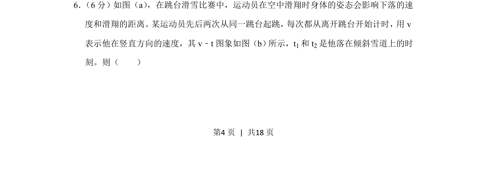
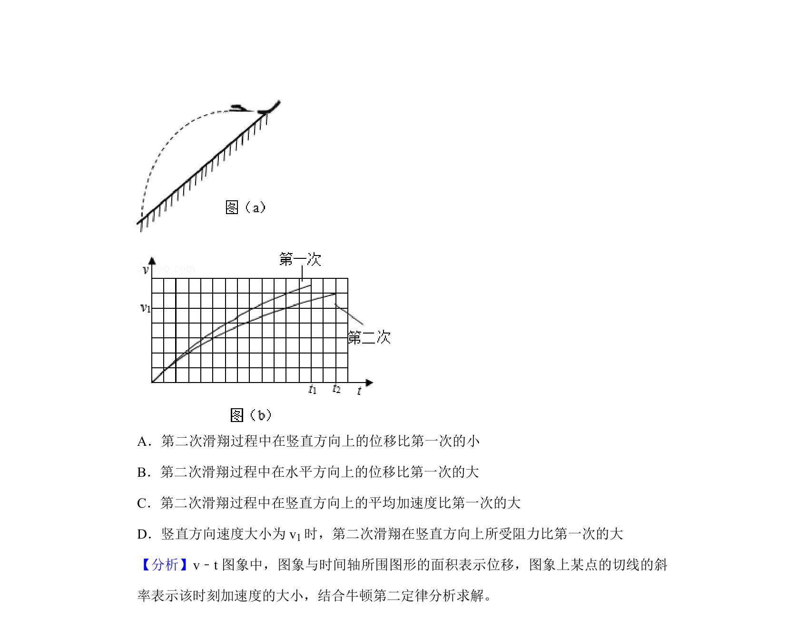
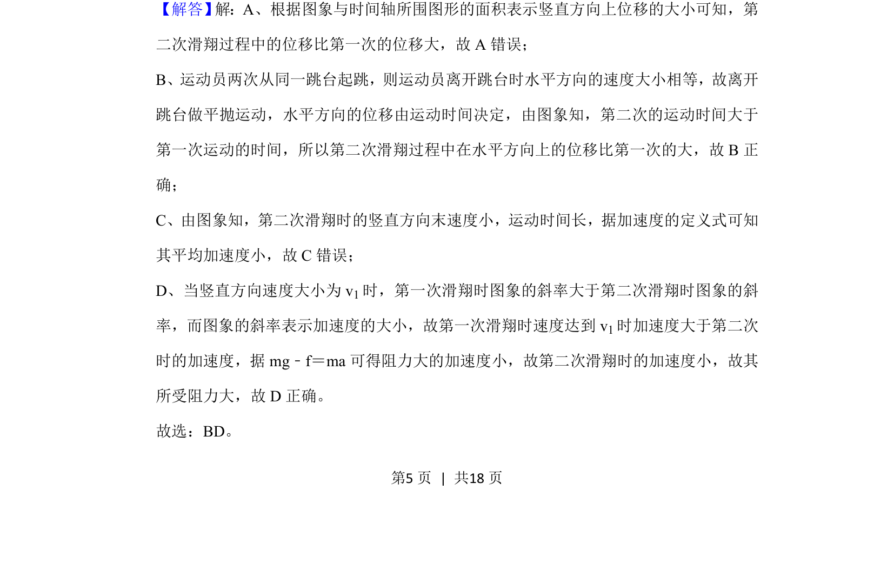

## 题面

## 摘要

本题考查根据v-t图象分析竖直方向速度变化与运动过程的关系。

## 关联考点

- [[527-函数图象分析|函数图象分析]]
- [[779-速度-时间图象|速度-时间图象]]
- [[620-斜率与加速度|斜率与加速度]]
- [[493-面积与位移|面积与位移]]

## 答案与解析

> 📄 原 PDF 第 4 页：`素材/真题/吉林/2008-2024·（吉林）物理高考真题/2019年高考物理试卷（新课标Ⅱ）（解析卷）.pdf`
