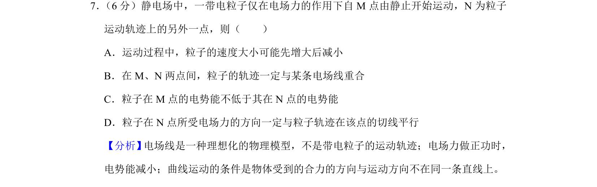
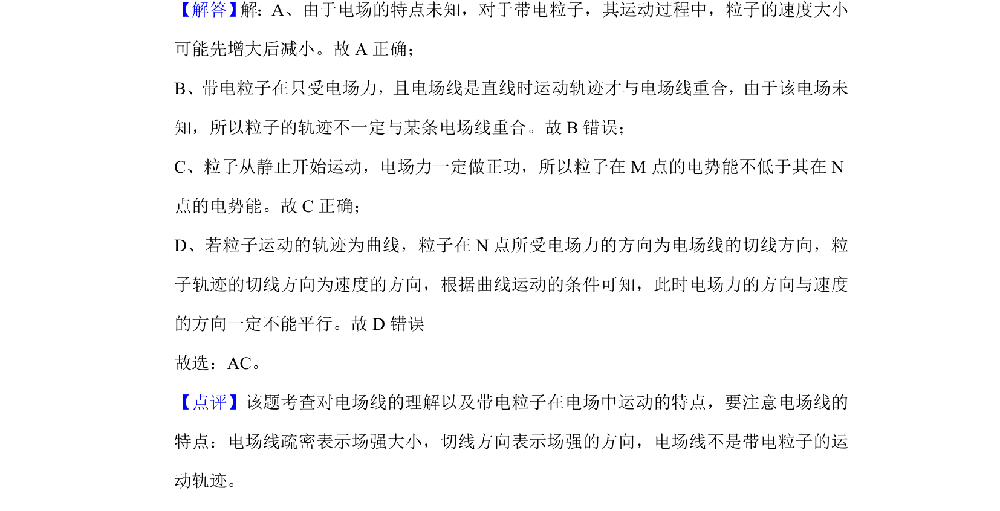

## 题面

## 摘要

带电粒子在电场中的运动分析，涉及速度变化、轨迹与电场线关系及电势能判断

## 关联考点

- [[673-电场力做功|电场力做功]]
- [[276-电势能|电势能]]
- [[623-曲线运动条件|曲线运动条件]]
- [[278-电场线|电场线]]

## 答案与解析

> 📄 原 PDF 第 6 页：`素材/真题/吉林/2008-2024·（吉林）物理高考真题/2019年高考物理试卷（新课标Ⅱ）（解析卷）.pdf`
