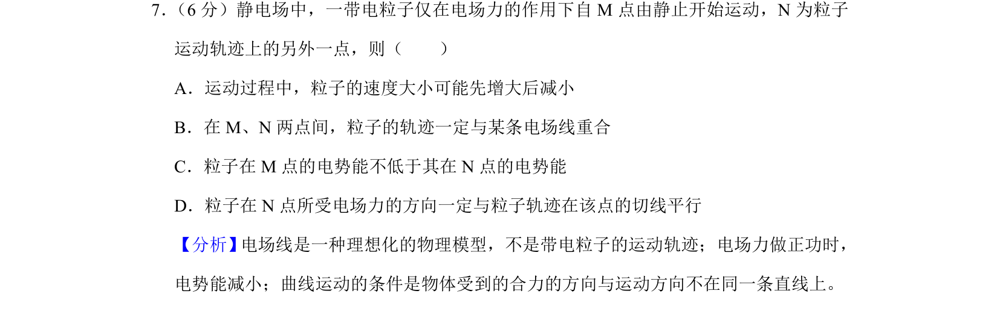
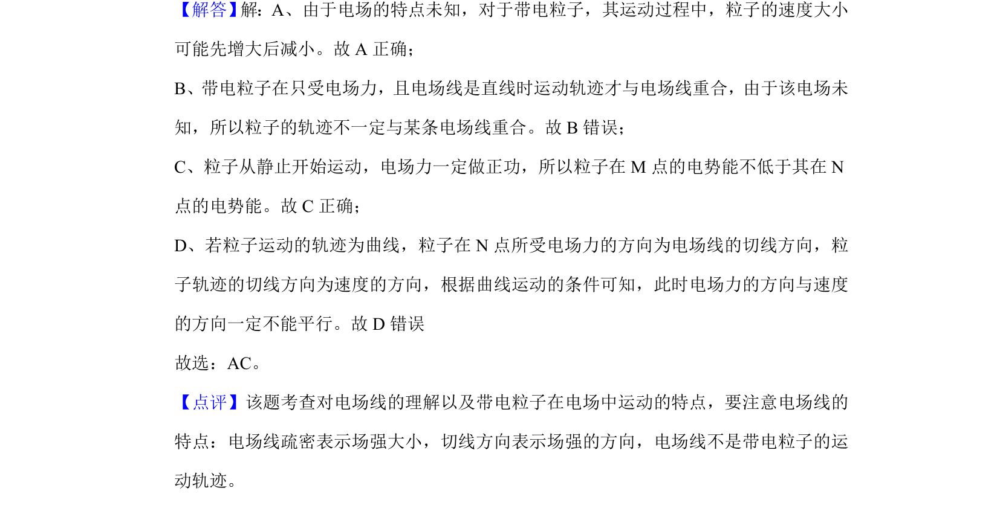

## 题面

## 摘要

带电粒子在电场中的运动分析，涉及速度变化、轨迹与电场线关系及电势能判断

## 关联考点

- [[673-电场力做功|电场力做功]]
- [[276-电势能|电势能]]
- [[623-曲线运动条件|曲线运动条件]]
- [[278-电场线|电场线]]

## 答案与解析

> 📄 原 PDF 第 6 页：`素材/真题/吉林/2008-2024·（吉林）物理高考真题/2019年高考物理试卷（新课标Ⅱ）（解析卷）.pdf`

<!-- 题干文本-start -->
## 题干文本
7． （6分）静电场中，一带电粒子仅在电场力的作用下自M点由静止开始运动，N为粒子
运动轨迹上的另外一点，则（　　）
A．运动过程中，粒子的速度大小可能先增大后减小
B．在M、N两点间，粒子的轨迹一定与某条电场线重合
C．粒子在M点的电势能不低于其在N点的电势能
D．粒子在N点所受电场力的方向一定与粒子轨迹在该点的切线平行
<!-- 题干文本-end -->

<!-- 解析文本-start -->
## 解析文本
【分析】 电场线是一种理想化的物理模型，不是带电粒子的运动轨迹；电场力做正功时，
电势能减小；曲线运动的条件是物体受到的合力的方向与运动方向不在同一条直线上。
【解答】 解：A、由于电场的特点未知，对于带电粒子，其运动过程中，粒子的速度大小
可能先增大后减小。故A正确；
B、带电粒子在只受电场力，且电场线是直线时运动轨迹才与电场线重合，由于该电场未
知，所以粒子的轨迹不一定与某条电场线重合。故B错误；
C、粒子从静止开始运动，电场力一定做正功，所以粒子在M点的电势能不低于其在N
点的电势能。故C正确；
D、若粒子运动的轨迹为曲线，粒子在N点所受电场力的方向为电场线的切线方向，粒
子轨迹的切线方向为速度的方向，根据曲线运动的条件可知，此时电场力的方向与速度
的方向一定不能平行。故D错误
故选：AC。
【点评】该题考查对电场线的理解以及带电粒子在电场中运动的特点，要注意电场线的
特点：电场线疏密表示场强大小，切线方向表示场强的方向，电场线不是带电粒子的运
动轨迹。
<!-- 解析文本-end -->
