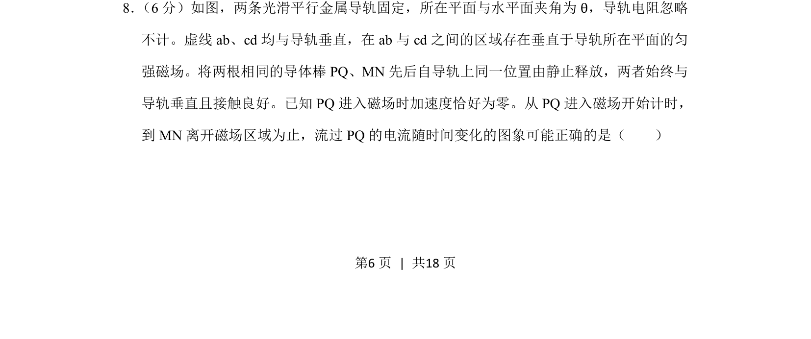
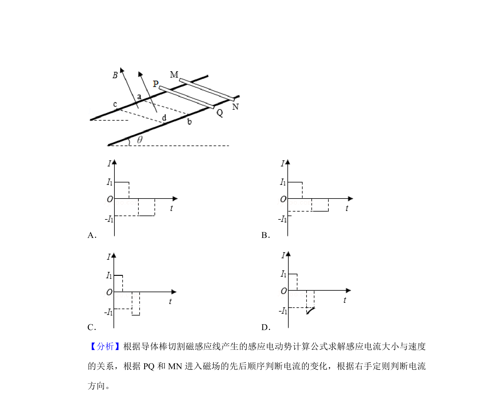
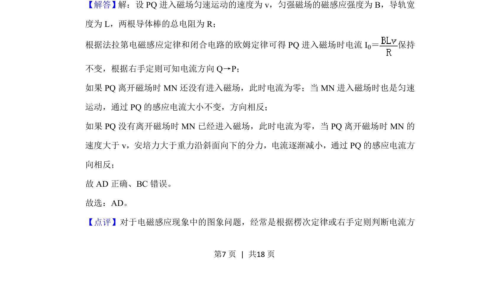
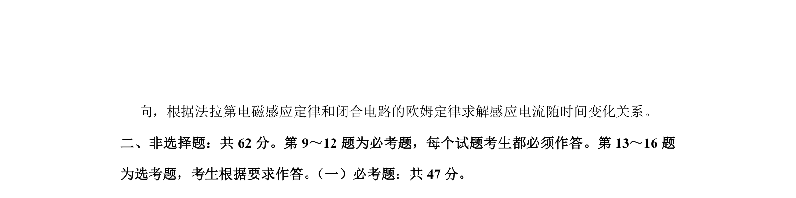

## 题面

## 摘要

两导体棒先后释放进出磁场，分析流过PQ的感应电流随时间变化图像。

## 关联考点

- [[175-电磁感应|电磁感应]]
- [[393-楞次定律|楞次定律]]
- [[188-磁场对通电导体的作用|安培力]]
- [[733-运动学|运动学]]

## 答案与解析

> 📄 原 PDF 第 6 页：`素材/真题/吉林/2008-2024·（吉林）物理高考真题/2019年高考物理试卷（新课标Ⅱ）（解析卷）.pdf`
