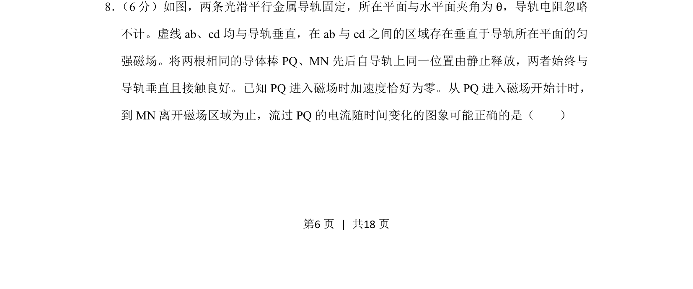
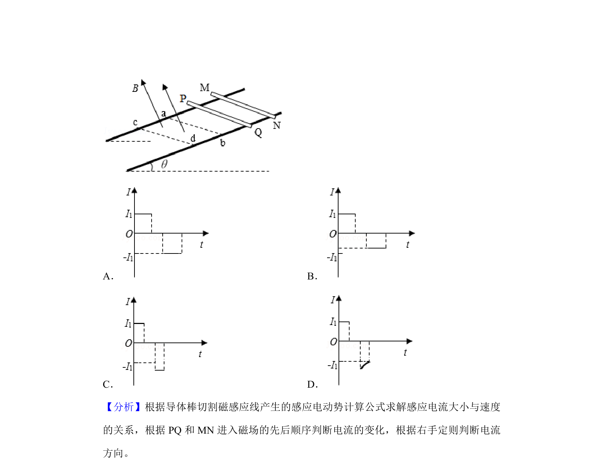
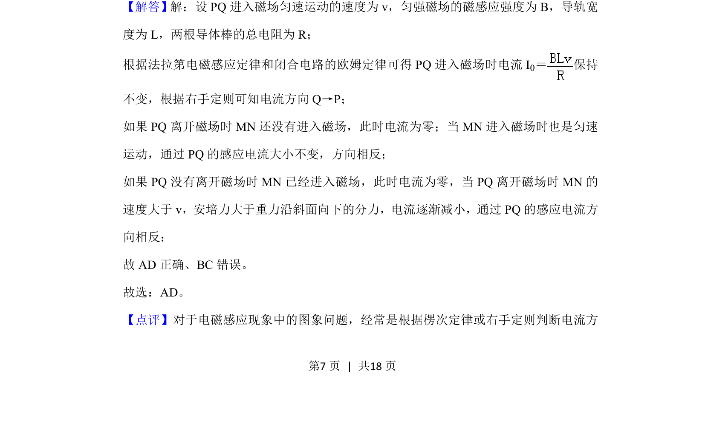
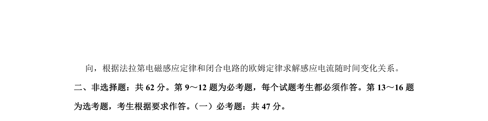

## 题面

## 摘要

两导体棒先后释放进出磁场，分析流过PQ的感应电流随时间变化图像。

## 关联考点

- [[175-电磁感应|电磁感应]]
- [[393-楞次定律|楞次定律]]
- [[188-磁场对通电导体的作用|安培力]]
- [[732-运动学|运动学]]

## 答案与解析

> 📄 原 PDF 第 6 页：`素材/真题/吉林/2008-2024·（吉林）物理高考真题/2019年高考物理试卷（新课标Ⅱ）（解析卷）.pdf`

<!-- 题干文本-start -->
## 题干文本
8． （6分）如图，两条光滑平行金属导轨固定，所在平面与水平面夹角为θ，导轨电阻忽略
不计。虚线ab、cd均与导轨垂直，在ab与cd之间的区域存在垂直于导轨所在平面的匀
强磁场。将两根相同的导体棒PQ、MN先后自导轨上同一位置由静止释放，两者始终与
导轨垂直且接触良好。已知PQ进入磁场时加速度恰好为零。从PQ进入磁场开始计时，
到MN离开磁场区域为止，流过PQ的电流随时间变化的图象可能正确的是（　　）
<!-- 题干文本-end -->

<!-- 解析文本-start -->
## 解析文本

<!-- 解析文本-end -->
