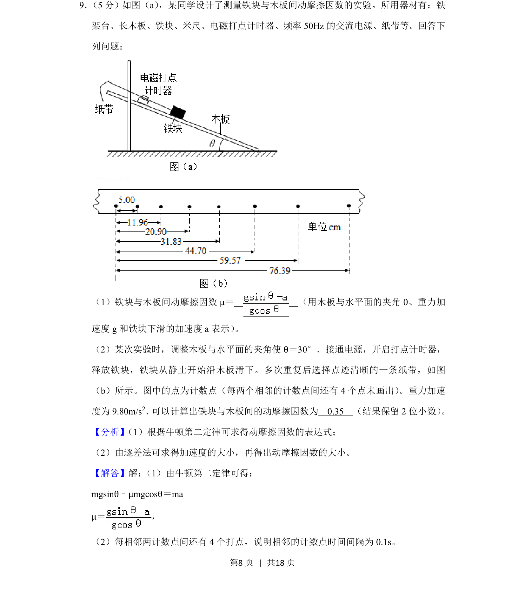
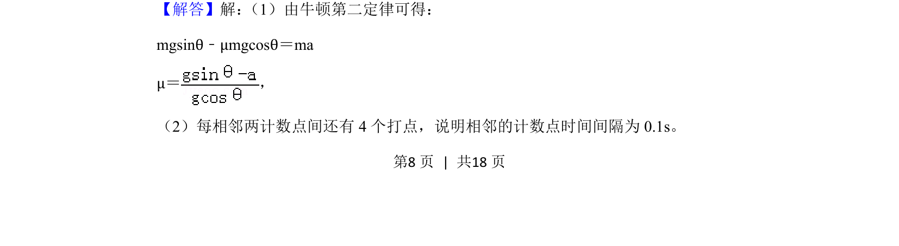
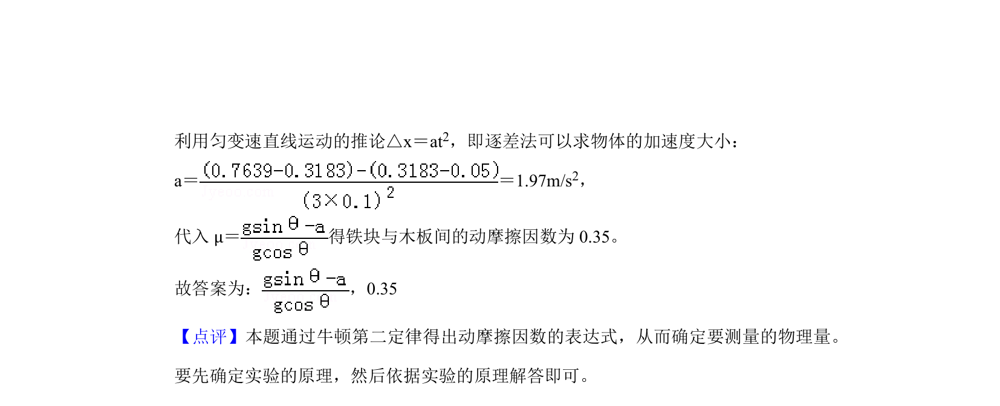

## 题面

## 摘要

用牛顿第二定律推导动摩擦因数表达式，并通过纸带逐差法计算加速度求得动摩擦因数

## 关联考点

- [[229-牛顿第二定律|牛顿第二定律]]
- [[动摩擦因数]]
- [[逐差法]]
- [[打点计时器]]

## 答案与解析

> 📄 原 PDF 第 8 页：`素材/真题/吉林/2008-2024·（吉林）物理高考真题/2019年高考物理试卷（新课标Ⅱ）（解析卷）.pdf`
