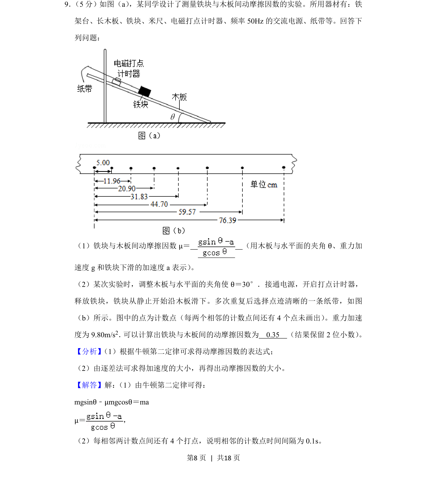
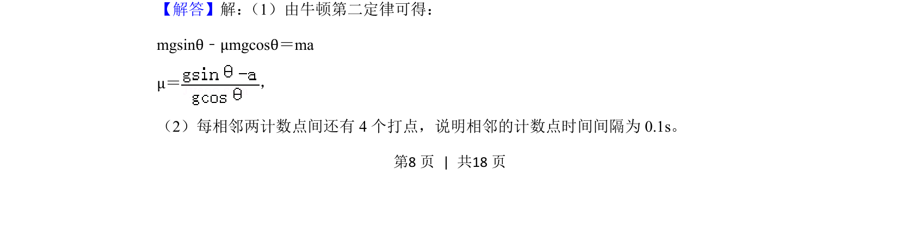
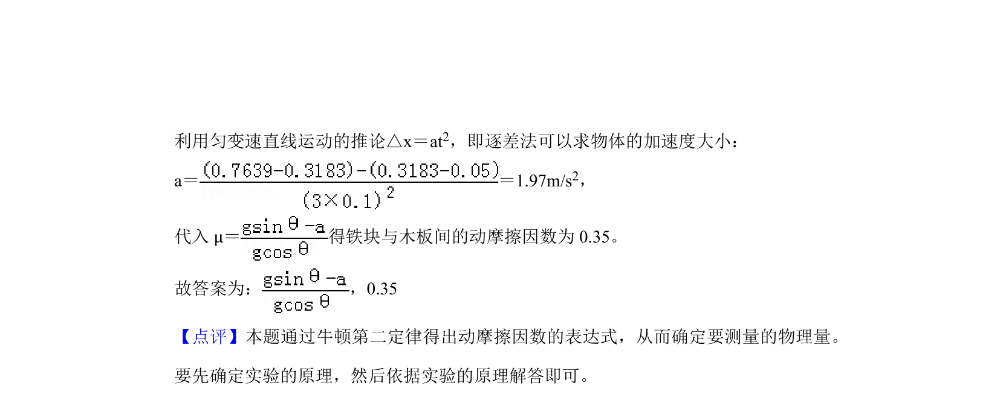

## 题面

## 摘要

用牛顿第二定律推导动摩擦因数表达式，并通过纸带逐差法计算加速度求得动摩擦因数

## 关联考点

- [[229-牛顿第二定律|牛顿第二定律]]
- [[537-动摩擦因数|动摩擦因数]]
- [[740-逐差法|逐差法]]
- [[755-打点计时器|打点计时器]]

## 答案与解析

> 📄 原 PDF 第 8 页：`素材/真题/吉林/2008-2024·（吉林）物理高考真题/2019年高考物理试卷（新课标Ⅱ）（解析卷）.pdf`

<!-- 题干文本-start -->
## 题干文本
9． （5分）如图（a） ，某同学设计了测量铁块与木板间动摩擦因数的实验。所用器材有：铁
架台、长木板、铁块、米尺、电磁打点计时器、频率50Hz的交流电源、纸带等。回答下
列问题：
（1）铁块与木板间动摩擦因数μ＝　 　（用木板与水平面的夹角θ、重力加
速度g和铁块下滑的加速度a表示） 。
（2）某次实验时，调整木板与水平面的夹角使θ＝30°．接通电源，开启打点计时器，
释放铁块，铁块从静止开始沿木板滑下。多次重复后选择点迹清晰的一条纸带，如图
（b）所示。图中的点为计数点（每两个相邻的计数点间还有4个点未画出） 。重力加速
度为9.80m/s 2． 可以计算出铁块与木板间的动摩擦因数为　0.35　（结果保留2位小数） 。
<!-- 题干文本-end -->

<!-- 解析文本-start -->
## 解析文本
【分析】 （1）根据牛顿第二定律可求得动摩擦因数的表达式；
（2）由逐差法可求得加速度的大小，再得出动摩擦因数的大小。
【解答】解： （1）由牛顿第二定律可得：
mgsinθ﹣μmgcosθ＝ma
μ＝ ，
（2）每相邻两计数点间还有4个打点，说明相邻的计数点时间间隔为0.1s。
<!-- 解析文本-end -->
