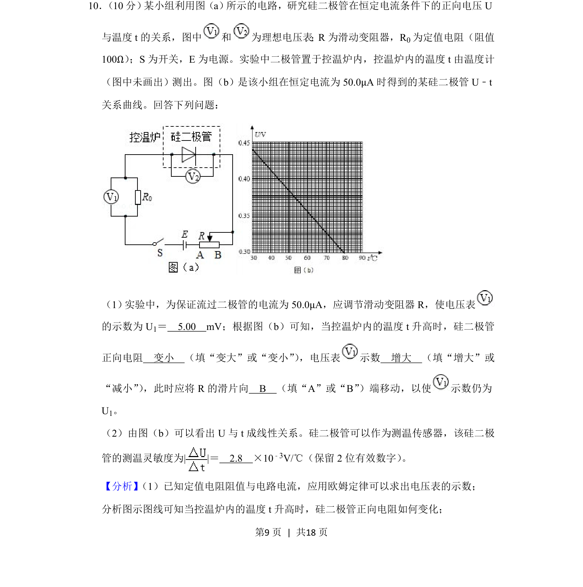
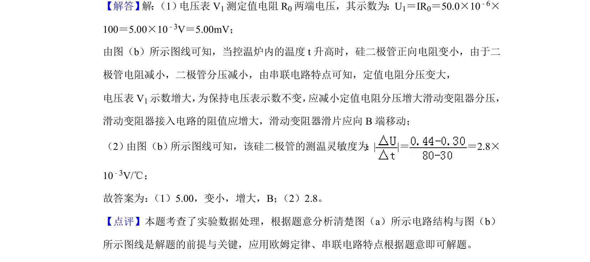

## 题面

## 摘要

研究硅二极管在恒定电流下正向电压与温度的关系，涉及欧姆定律及数据处理。

## 关联考点

- [[141-欧姆定律-初中|欧姆定律]]
- [[452-二极管正向电阻|二极管正向电阻]]
- [[581-实验数据分析|实验数据分析]]
- [[657-灵敏度计算|灵敏度计算]]

## 答案与解析

> 📄 原 PDF 第 9 页：`素材/真题/吉林/2008-2024·（吉林）物理高考真题/2019年高考物理试卷（新课标Ⅱ）（解析卷）.pdf`
