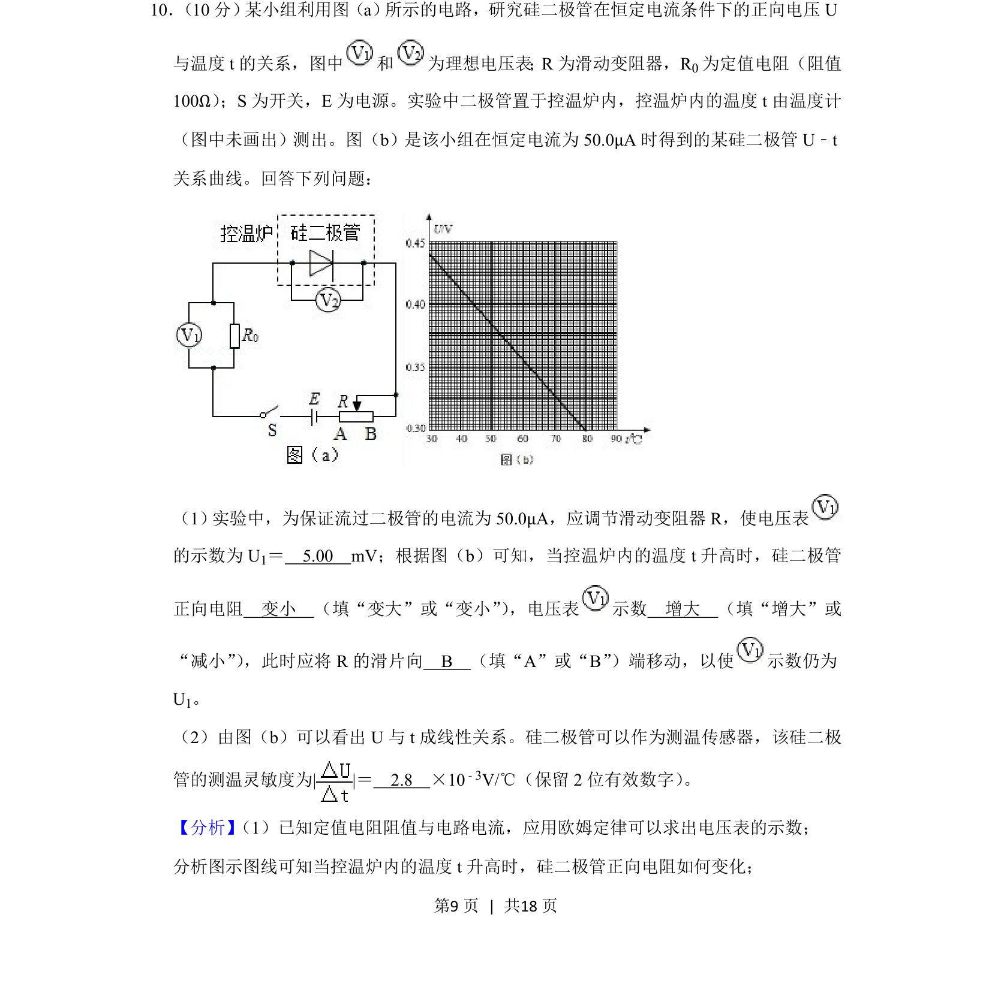
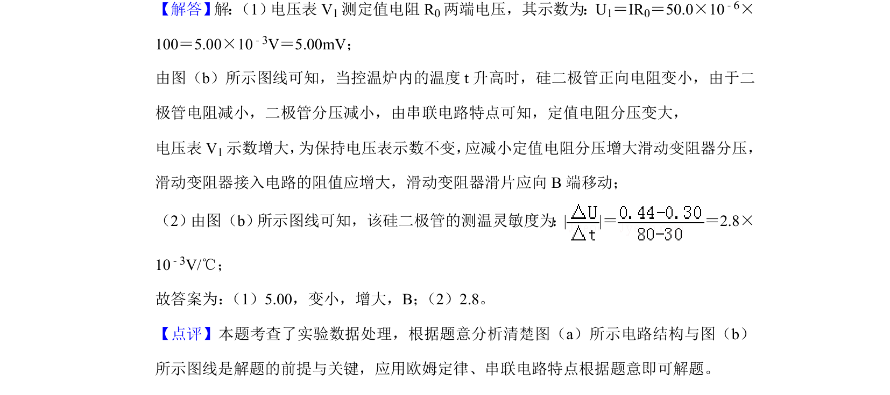

## 题面

## 摘要

研究硅二极管在恒定电流下正向电压与温度的关系，涉及欧姆定律及数据处理。

## 关联考点

- [[141-欧姆定律-初中|欧姆定律]]
- [[452-二极管正向电阻|二极管正向电阻]]
- [[581-实验数据分析|实验数据分析]]
- [[657-灵敏度计算|灵敏度计算]]

## 答案与解析

> 📄 原 PDF 第 9 页：`素材/真题/吉林/2008-2024·（吉林）物理高考真题/2019年高考物理试卷（新课标Ⅱ）（解析卷）.pdf`

<!-- 题干文本-start -->
## 题干文本
10． （10分） 某小组利用图（a） 所示的电路，研究硅二极管在恒定电流条件下的正向电压U
与温度t的关系，图中 和 为理想电压表；R为滑动变阻器，R 0为定值电阻（阻值
100Ω） ；S为开关，E为电源。实验中二极管置于控温炉内，控温炉内的温度t由温度计
（图中未画出）测出。图（b）是该小组在恒定电流为50.0μA时得到的某硅二极管U﹣t
关系曲线。回答下列问题：
（1） 实验中，为保证流过二极管的电流为50.0μA，应调节滑动变阻器R，使电压表
的示数为U 1＝　5.00　mV；根据图（b）可知，当控温炉内的温度t升高时，硅二极管
正向电阻　变小　（填“变大”或“变小”） ，电压表 示数　增大　（填“增大”或
“减小”） ，此时应将R的滑片向　B　（填“A”或“B”）端移动，以使 示数仍为
U1。
（2）由图（b）可以看出U与t成线性关系。硅二极管可以作为测温传感器，该硅二极
管的测温灵敏度为| |＝　2.8　×10 ﹣3V/℃（保留2位有效数字） 。
<!-- 题干文本-end -->

<!-- 解析文本-start -->
## 解析文本
【分析】 （1）已知定值电阻阻值与电路电流，应用欧姆定律可以求出电压表的示数；
分析图示图线可知当控温炉内的温度t升高时，硅二极管正向电阻如何变化；
<!-- 解析文本-end -->
