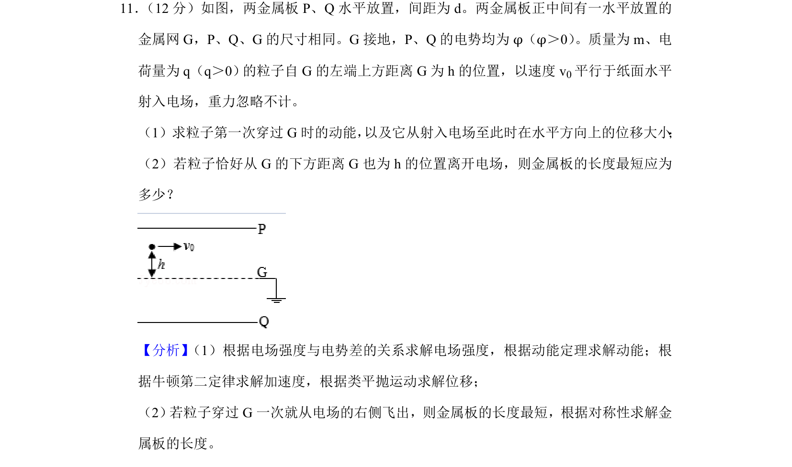
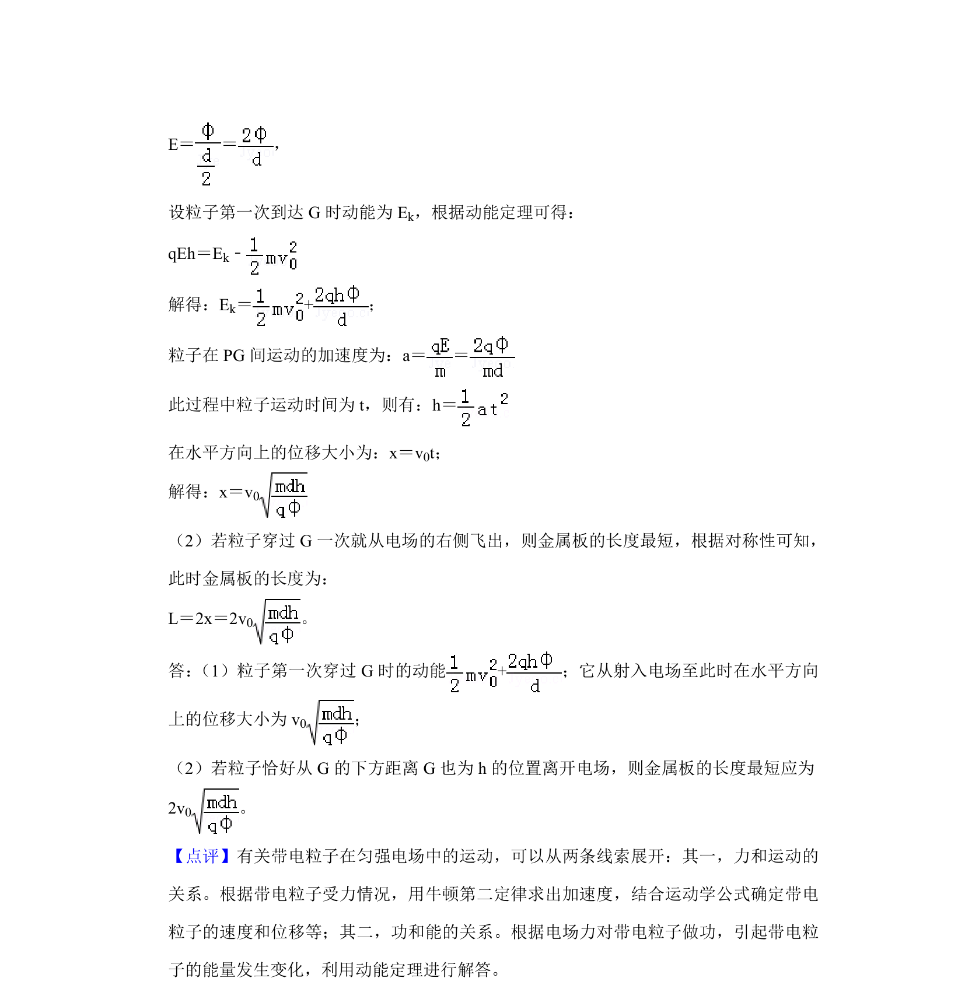

## 题面

## 摘要

带电粒子在匀强电场中的类平抛运动，涉及动能定理和对称性求最短板长

## 关联考点

- [[251-动能定理|动能定理]]
- [[488-类平抛运动|类平抛运动]]
- [[835-对称性|对称性]]

## 答案与解析

> 📄 原 PDF 第 10 页：`素材/真题/吉林/2008-2024·（吉林）物理高考真题/2019年高考物理试卷（新课标Ⅱ）（解析卷）.pdf`

<!-- 题干文本-start -->
## 题干文本
11． （12分）如图，两金属板P、Q水平放置，间距为d。两金属板正中间有一水平放置的
金属网G，P、Q、G的尺寸相同。G接地，P、Q的电势均为φ（φ＞0） 。质量为m、电
荷量为q（q＞0） 的粒子自G的左端上方距离G为h的位置，以速度v 0平行于纸面水平
射入电场，重力忽略不计。
（1）求粒子第一次穿过G时的动能， 以及它从射入电场至此时在水平方向上的位移大小 ；
（2）若粒子恰好从G的下方距离G也为h的位置离开电场，则金属板的长度最短应为
多少？
<!-- 题干文本-end -->

<!-- 解析文本-start -->
## 解析文本
【分析】 （1）根据电场强度与电势差的关系求解电场强度，根据动能定理求解动能；根
据牛顿第二定律求解加速度，根据类平抛运动求解位移；
（2） 若粒子穿过G一次就从电场的右侧飞出，则金属板的长度最短，根据对称性求解金
属板的长度。
【解答】解： （1）PG、QG间的电场强度大小相等、方向相反，设为E，则有：
<!-- 解析文本-end -->
