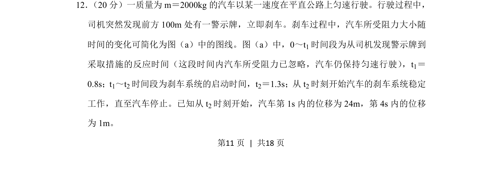
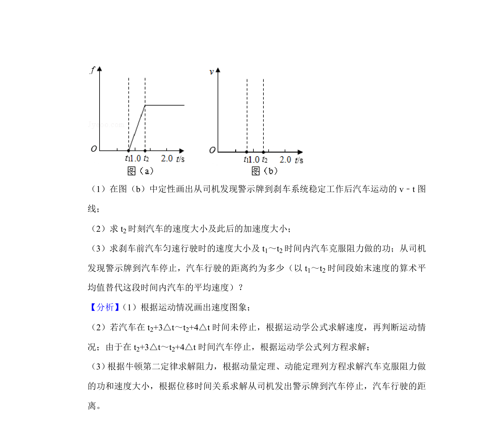
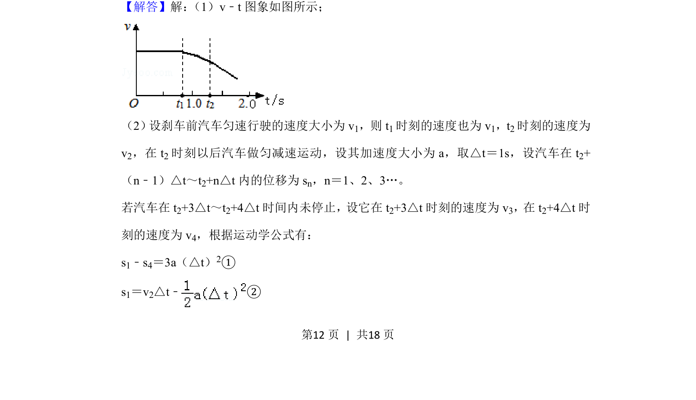
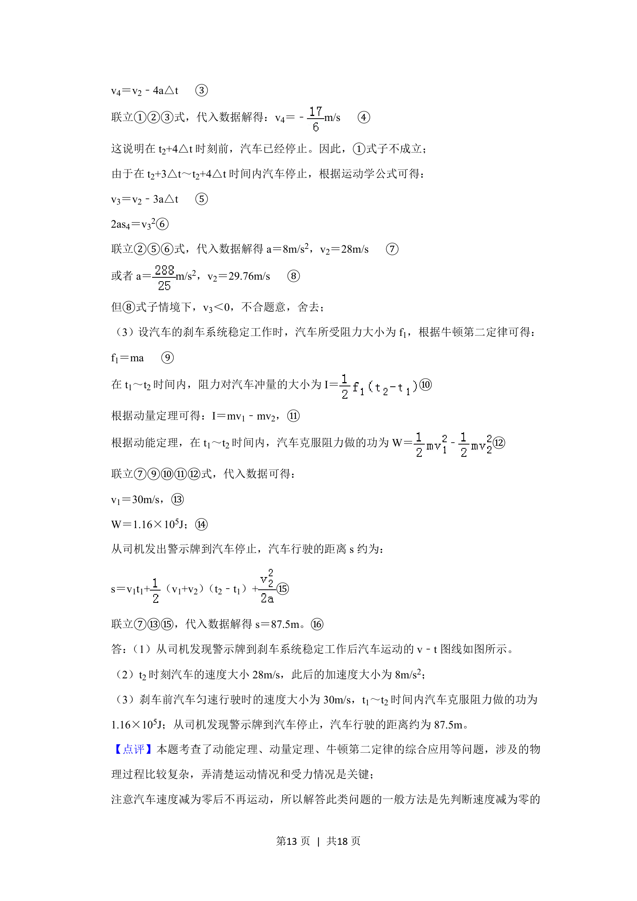
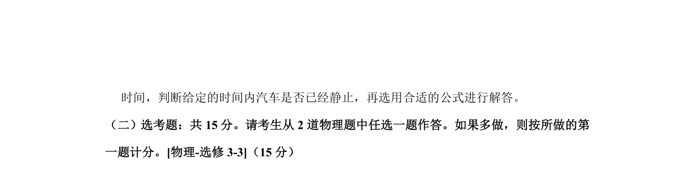

## 题面

## 摘要

汽车刹车过程中的运动学分析，涉及反应阶段、启动阶段和稳定制动阶段的位移与时间关系计算。

## 关联考点

- [[215-匀变速直线运动|匀变速直线运动]]
- [[206-位移公式-匀变速|位移公式]]
- [[290-分段函数|分段函数]]
- [[数学建模]]

## 答案与解析

> 📄 原 PDF 第 11 页：`素材/真题/吉林/2008-2024·（吉林）物理高考真题/2019年高考物理试卷（新课标Ⅱ）（解析卷）.pdf`
