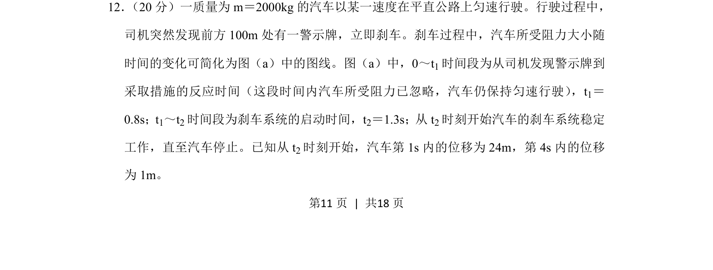
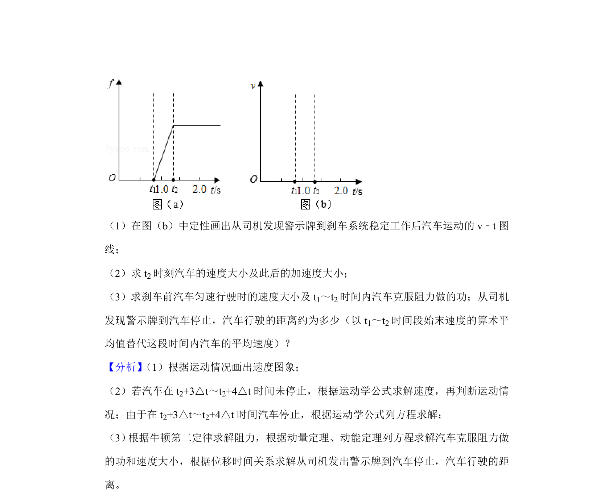
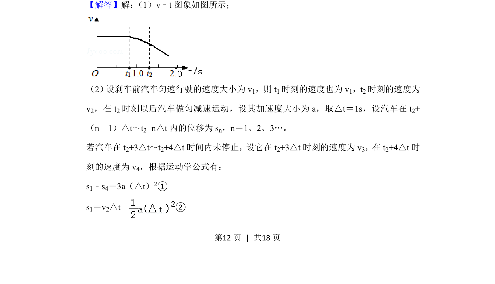
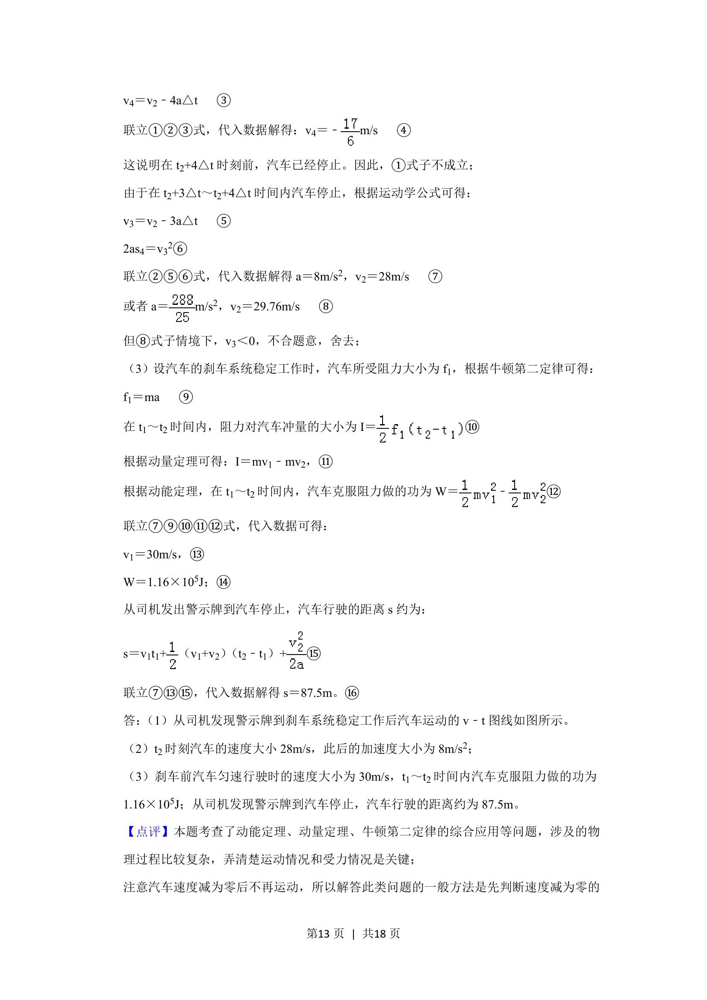
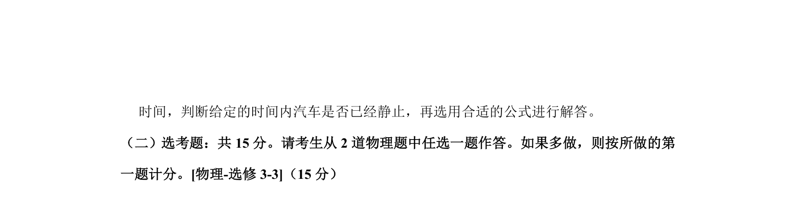

## 题面

## 摘要

汽车刹车问题，结合反应时间和阻力变化图线，分析多阶段运动并计算位移与速度。

## 关联考点

- [[215-匀变速直线运动|匀变速直线运动]]
- [[229-牛顿第二定律|牛顿第二定律]]
- [[492-运动图像|运动图像]]
- [[529-刹车问题|刹车问题]]

## 答案与解析

> 📄 原 PDF 第 11 页：`素材/真题/吉林/2008-2024·（吉林）物理高考真题/2019年高考物理试卷（新课标Ⅱ）（解析卷）.pdf`

<!-- 题干文本-start -->
## 题干文本
12． （20分）一质量为m＝2000kg的汽车以某一速度在平直公路上匀速行驶。行驶过程中，
司机突然发现前方100m处有一警示牌，立即刹车。刹车过程中，汽车所受阻力大小随
时间的变化可简化为图（a）中的图线。图（a）中，0～t1时间段为从司机发现警示牌到
采取措施的反应时间（这段时间内汽车所受阻力已忽略，汽车仍保持匀速行驶） ，t1＝
0.8s；t1～t2时间段为刹车系统的启动时间，t2＝1.3s；从t 2时刻开始汽车的刹车系统稳定
工作，直至汽车停止。已知从t 2时刻开始，汽车第1s内的位移为24m，第4s内的位移
为1m。
<!-- 题干文本-end -->

<!-- 解析文本-start -->
## 解析文本

<!-- 解析文本-end -->
