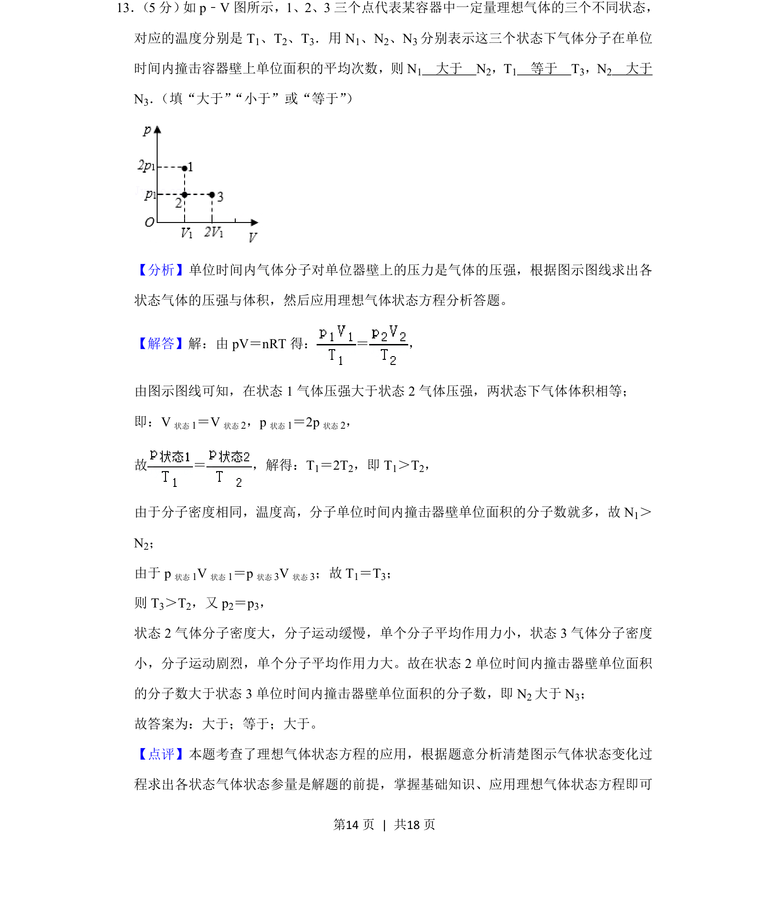
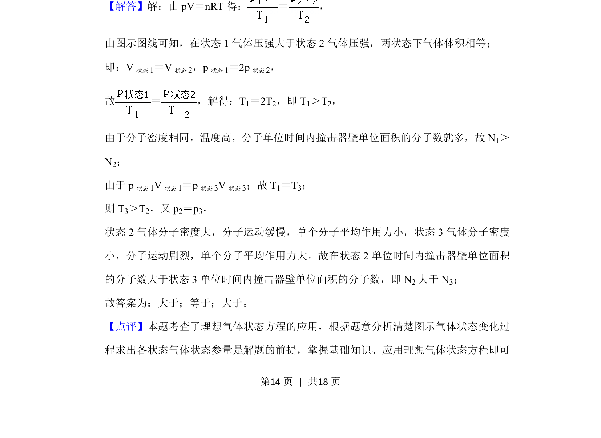

## 题面

## 摘要

该题通过 p-V 图分析理想气体的压强、体积与温度关系，比较不同状态下气体分子撞击器壁的次数。

## 关联考点

- [[446-理想气体状态方程|理想气体状态方程]]
- [[比例关系]]
- [[037-推理|逻辑推理]]

## 答案与解析

> 📄 原 PDF 第 14 页：`素材/真题/吉林/2008-2024·（吉林）物理高考真题/2019年高考物理试卷（新课标Ⅱ）（解析卷）.pdf`
