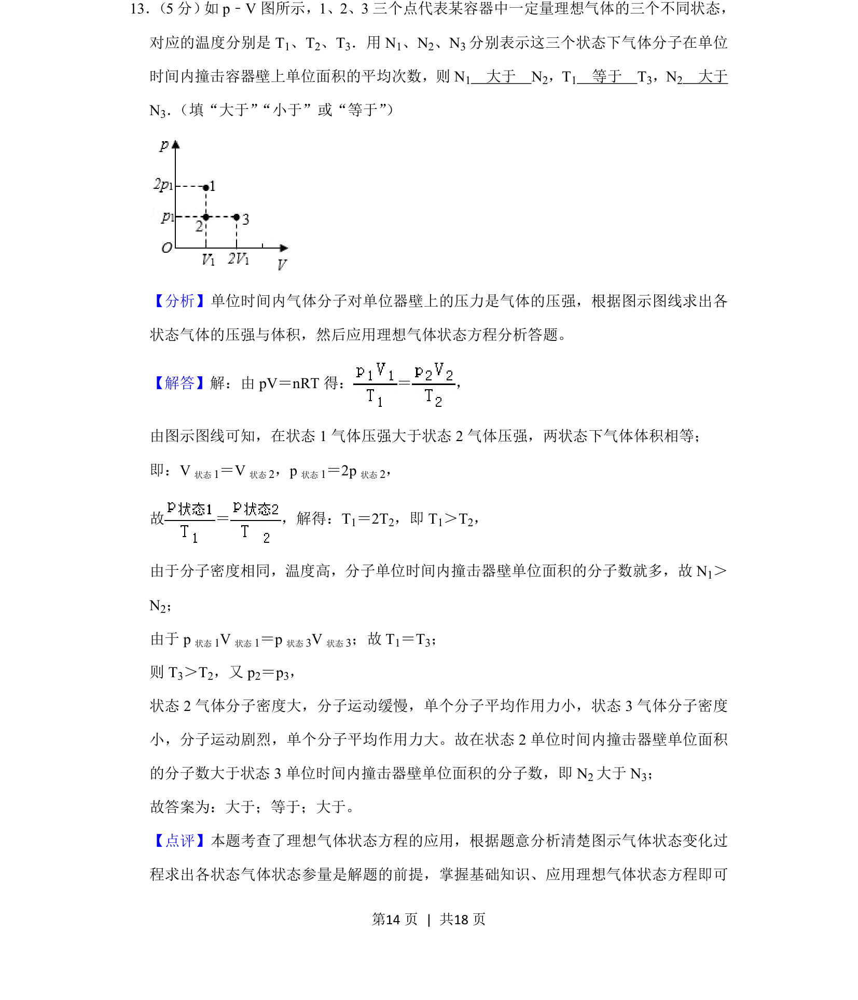
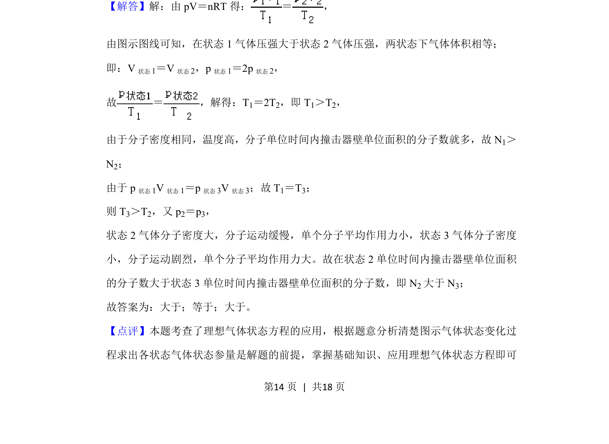

## 题面

## 摘要

通过p-V图分析理想气体不同状态下的温度关系及单位时间单位面积分子撞击次数比较

## 关联考点

- [[446-理想气体状态方程|理想气体状态方程]]
- [[637-气体压强微观意义|气体压强微观意义]]
- [[130-分子热运动|分子热运动]]
- [[564-图像分析|图像分析]]

## 答案与解析

> 📄 原 PDF 第 14 页：`素材/真题/吉林/2008-2024·（吉林）物理高考真题/2019年高考物理试卷（新课标Ⅱ）（解析卷）.pdf`

<!-- 题干文本-start -->
## 题干文本
13． （5分） 如p﹣V图所示，1、2、3三个点代表某容器中一定量理想气体的三个不同状态，
对应的温度分别是T 1、T2、T3．用N 1、N2、N3分别表示这三个状态下气体分子在单位
时间内撞击容器壁上单位面积的平均次数，则N 1　大于　N2，T1　等于　T3，N2　大于　
N3． （填“大于” “小于”或“等于”）
<!-- 题干文本-end -->

<!-- 解析文本-start -->
## 解析文本
【分析】单位时间内气体分子对单位器壁上的压力是气体的压强，根据图示图线求出各
状态气体的压强与体积，然后应用理想气体状态方程分析答题。
【解答】解：由pV＝nRT得： ＝ ，
由图示图线可知，在状态1气体压强大于状态2气体压强，两状态下气体体积相等；
即：V 状态1＝V 状态2，p 状态1＝2p 状态2，
故 ＝ ，解得：T 1＝2T2，即T 1＞T2，
由于分子密度相同，温度高，分子单位时间内撞击器壁单位面积的分子数就多，故N 1＞
N2；
由于p 状态1 V 状态1＝p 状态3 V 状态3；故T 1＝T3；
则T 3＞T2，又p 2＝p3，
状态2气体分子密度大，分子运动缓慢，单个分子平均作用力小，状态3气体分子密度
小，分子运动剧烈，单个分子平均作用力大。故在状态2单位时间内撞击器壁单位面积
的分子数大于状态3单位时间内撞击器壁单位面积的分子数，即N 2大于N 3；
故答案为：大于；等于；大于。
【点评】本题考查了理想气体状态方程的应用，根据题意分析清楚图示气体状态变化过
程求出各状态气体状态参量是解题的前提，掌握基础知识、应用理想气体状态方程即可
<!-- 解析文本-end -->
