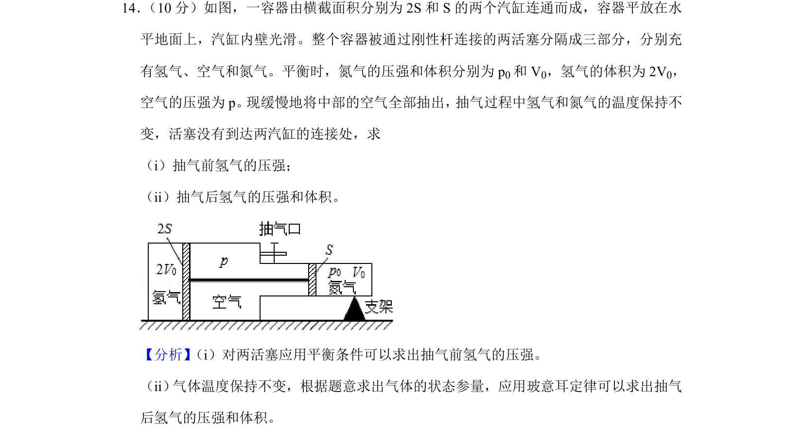
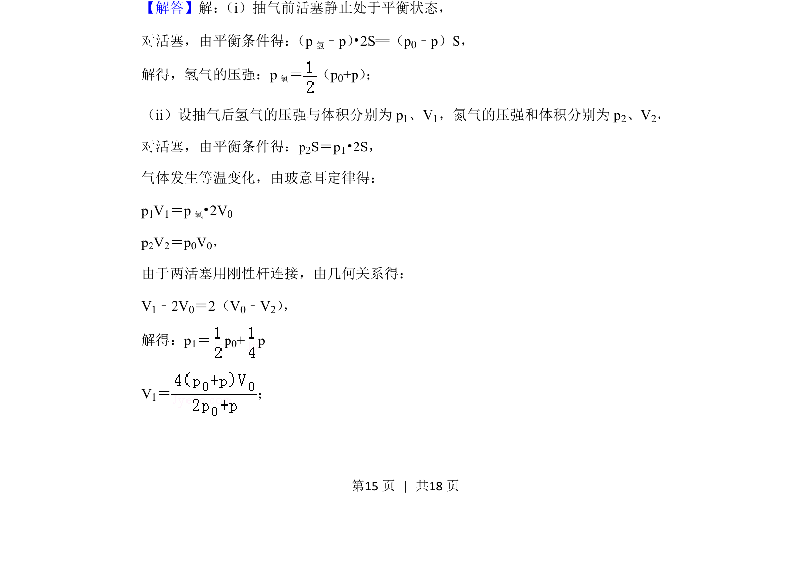
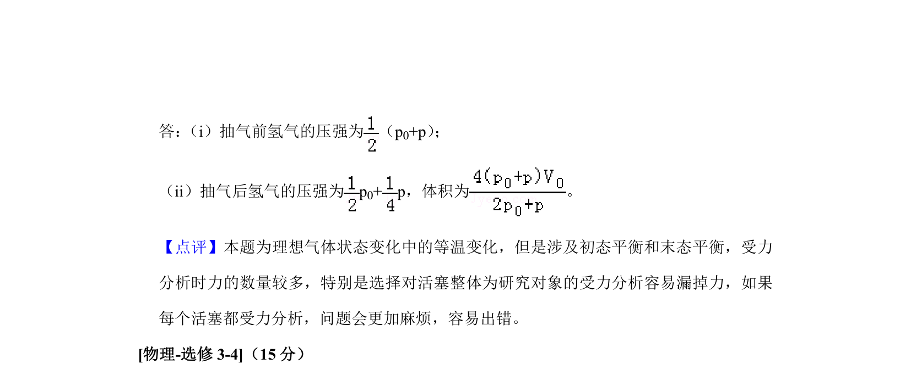

## 题面

## 摘要

利用平衡条件与玻意耳定律求解气体压强与体积。

## 关联考点

- [[力的平衡]]
- [[444-玻意耳定律|玻意耳定律]]
- [[444-玻意耳定律|等温变化]]
- [[061-方程|方程求解]]

## 答案与解析

> 📄 原 PDF 第 15 页：`素材/真题/吉林/2008-2024·（吉林）物理高考真题/2019年高考物理试卷（新课标Ⅱ）（解析卷）.pdf`
