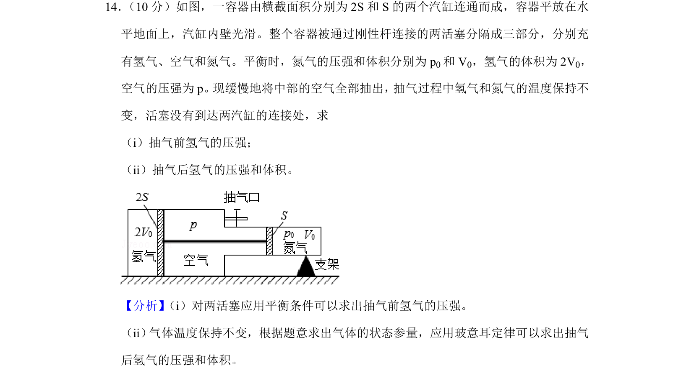
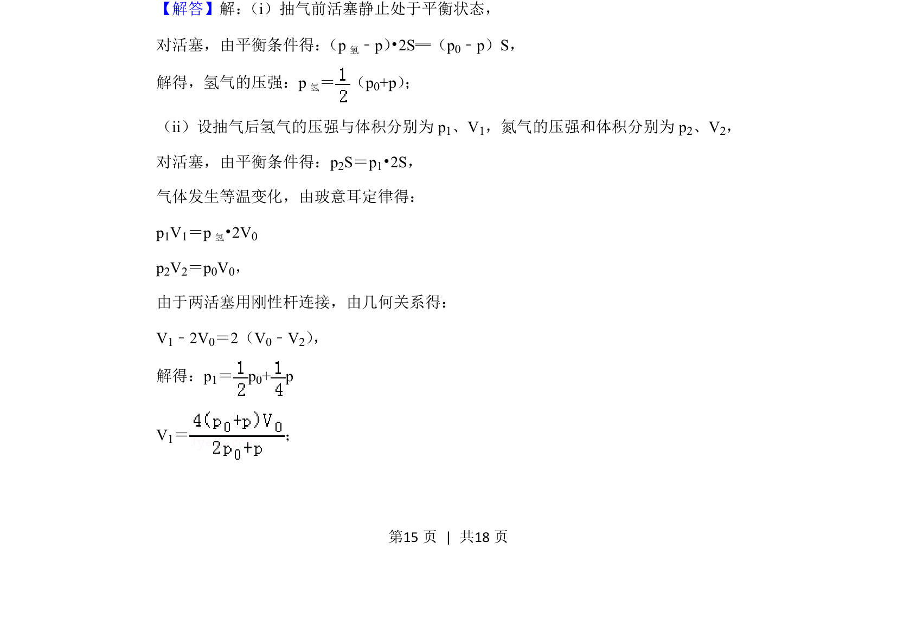
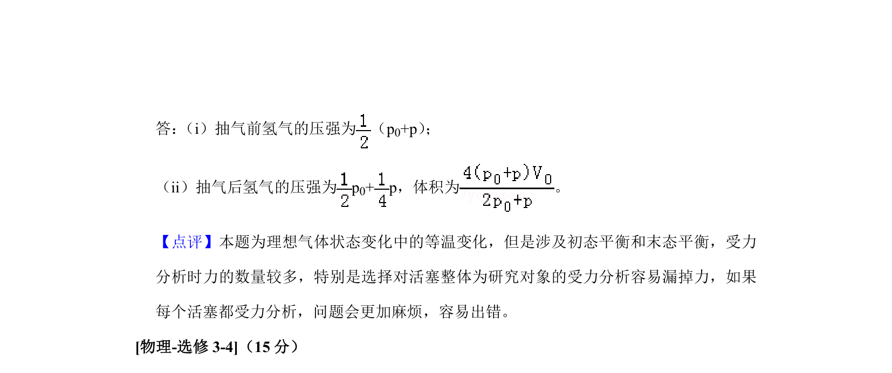

## 题面

## 摘要

利用平衡条件与玻意耳定律求解气体压强与体积。

## 关联考点

- [[533-力的平衡|力的平衡]]
- [[444-玻意耳定律|玻意耳定律]]
- [[444-玻意耳定律|等温变化]]
- [[061-方程|方程求解]]

## 答案与解析

> 📄 原 PDF 第 15 页：`素材/真题/吉林/2008-2024·（吉林）物理高考真题/2019年高考物理试卷（新课标Ⅱ）（解析卷）.pdf`

<!-- 题干文本-start -->
## 题干文本
14． （10分）如图，一容器由横截面积分别为2S和S的两个汽缸连通而成，容器平放在水
平地面上，汽缸内壁光滑。整个容器被通过刚性杆连接的两活塞分隔成三部分，分别充
有氢气、空气和氮气。平衡时，氮气的压强和体积分别为p 0和V 0，氢气的体积为2V 0，
空气的压强为p。 现缓慢地将中部的空气全部抽出， 抽气过程中氢气和氮气的温度保持不
变，活塞没有到达两汽缸的连接处，求
（i）抽气前氢气的压强；
（ii）抽气后氢气的压强和体积。
<!-- 题干文本-end -->

<!-- 解析文本-start -->
## 解析文本
【分析】 （i）对两活塞应用平衡条件可以求出抽气前氢气的压强。
（ii） 气体温度保持不变，根据题意求出气体的状态参量，应用玻意耳定律可以求出抽气
后氢气的压强和体积。
【解答】解： （i）抽气前活塞静止处于平衡状态，
对活塞，由平衡条件得： （p氢﹣p）•2S═（p0﹣p）S，
解得，氢气的压强：p 氢＝ （p 0+p） ；
（ii）设抽气后氢气的压强与体积分别为p 1、V1，氮气的压强和体积分别为p 2、V2，
对活塞，由平衡条件得：p2S＝p1•2S，
气体发生等温变化，由玻意耳定律得：
p1V1＝p 氢•2V0
p2V2＝p0V0，
由于两活塞用刚性杆连接，由几何关系得：
V1﹣2V0＝2（V0﹣V2） ，
解得：p1＝p 0+ p
V1＝ ；
<!-- 解析文本-end -->
