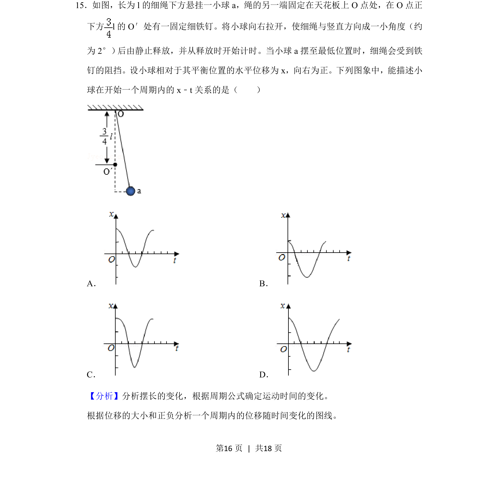
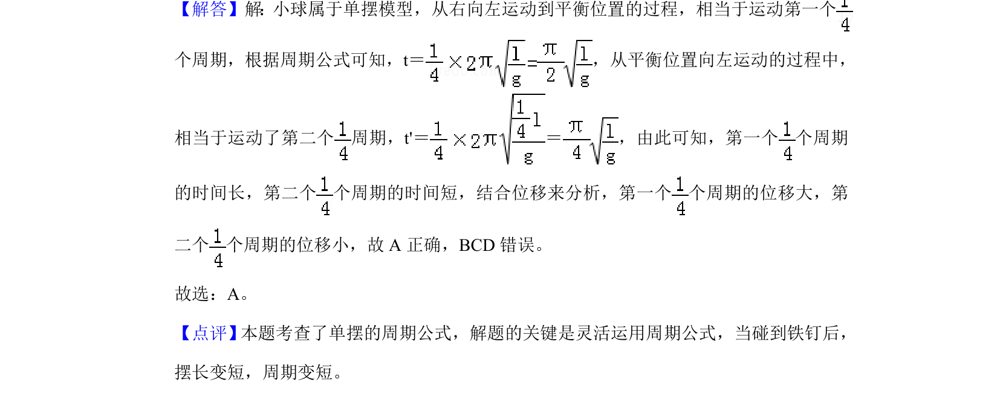

## 题面

## 摘要

单摆运动在摆长突变时的位移-时间关系图像判断

## 关联考点

- [[373-简谐运动|简谐运动]]
- [[351-单摆周期公式|单摆周期公式]]
- [[513-位移时间图像分析|位移时间图像分析]]

## 答案与解析

> 📄 原 PDF 第 16 页：`素材/真题/吉林/2008-2024·（吉林）物理高考真题/2019年高考物理试卷（新课标Ⅱ）（解析卷）.pdf`
