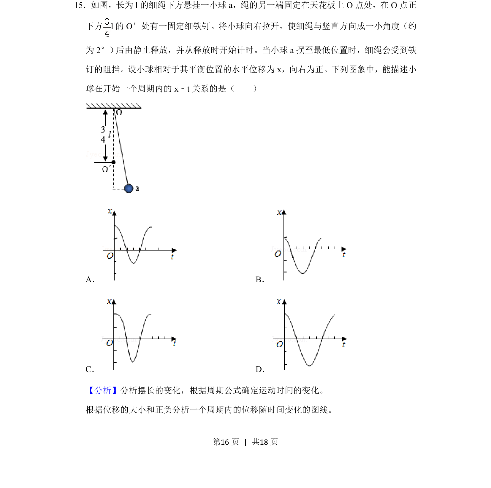
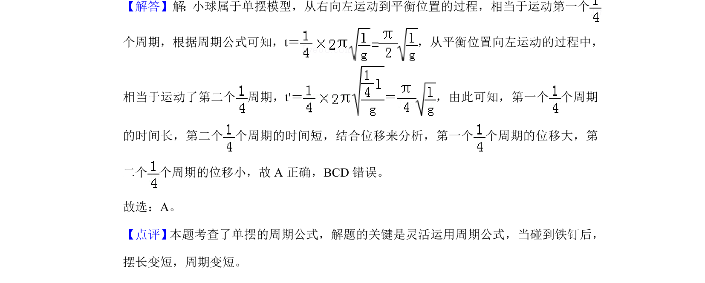

## 题面

## 摘要

单摆运动在摆长突变时的位移-时间关系图像判断

## 关联考点

- [[373-简谐运动|简谐运动]]
- [[351-单摆周期公式|单摆周期公式]]
- [[513-位移时间图像分析|位移时间图像分析]]

## 答案与解析

> 📄 原 PDF 第 16 页：`素材/真题/吉林/2008-2024·（吉林）物理高考真题/2019年高考物理试卷（新课标Ⅱ）（解析卷）.pdf`

<!-- 题干文本-start -->
## 题干文本
15．如图，长为l的细绳下方悬挂一小球a，绳的另一端固定在天花板上O点处，在O点正
下方l的O′处有一固定细铁钉。将小球向右拉开，使细绳与竖直方向成一小角度（约
为2°） 后由静止释放，并从释放时开始计时。当小球a摆至最低位置时，细绳会受到铁
钉的阻挡。设小球相对于其平衡位置的水平位移为x，向右为正。下列图象中，能描述小
球在开始一个周期内的x﹣t关系的是（　　）
A．B．
C．D．
<!-- 题干文本-end -->

<!-- 解析文本-start -->
## 解析文本
【分析】分析摆长的变化，根据周期公式确定运动时间的变化。
根据位移的大小和正负分析一个周期内的位移随时间变化的图线。
<!-- 解析文本-end -->
