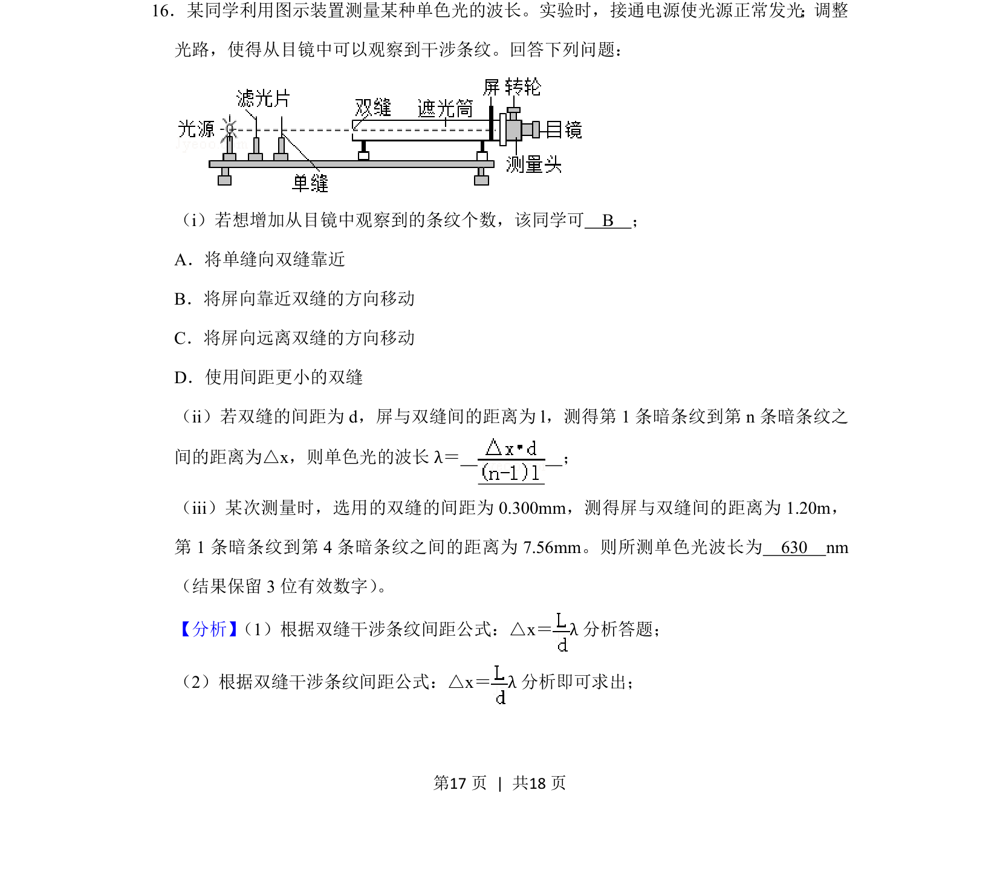
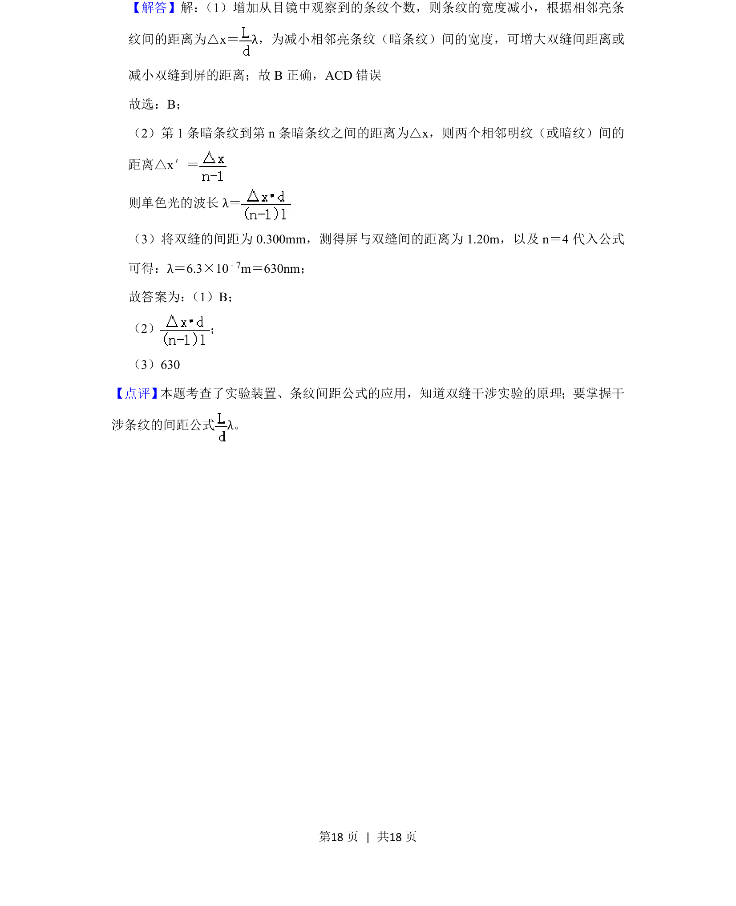

## 题面

## 摘要

该题考查双缝干涉实验操作、条纹数量变化分析及波长计算。

## 关联考点

- [[552-双缝干涉|双缝干涉]]
- [[766-条纹间距公式|条纹间距公式]]
- [[647-波长计算|波长计算]]

## 答案与解析

> 📄 原 PDF 第 17 页：`素材/真题/吉林/2008-2024·（吉林）物理高考真题/2019年高考物理试卷（新课标Ⅱ）（解析卷）.pdf`

<!-- 题干文本-start -->
## 题干文本
16．某同学利用图示装置测量某种单色光的波长。实验时，接通电源使光源正常发光；调整
光路，使得从目镜中可以观察到干涉条纹。回答下列问题：
（i）若想增加从目镜中观察到的条纹个数，该同学可　B　；
A．将单缝向双缝靠近
B．将屏向靠近双缝的方向移动
C．将屏向远离双缝的方向移动
D．使用间距更小的双缝
（ii）若双缝的间距为d，屏与双缝间的距离为l，测得第1条暗条纹到第n条暗条纹之
间的距离为△x，则单色光的波长λ＝　 　；
（iii）某次测量时，选用的双缝的间距为0.300mm，测得屏与双缝间的距离为1.20m，
第1条暗条纹到第4条暗条纹之间的距离为7.56mm。则所测单色光波长为　630　nm
（结果保留3位有效数字） 。
<!-- 题干文本-end -->

<!-- 解析文本-start -->
## 解析文本
【分析】 （1）根据双缝干涉条纹间距公式：△x＝λ分析答题；
（2）根据双缝干涉条纹间距公式：△x＝λ分析即可求出；
<!-- 解析文本-end -->
