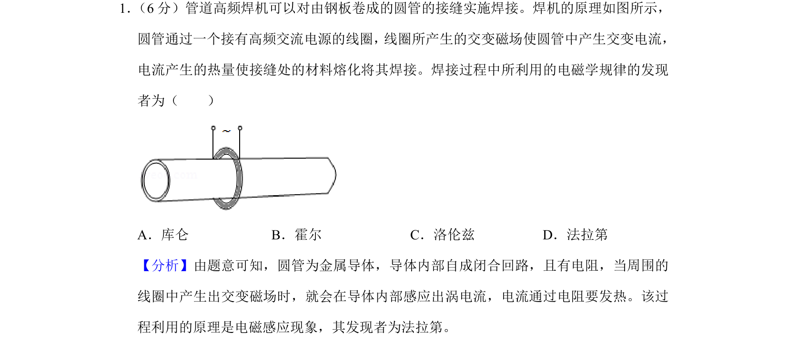
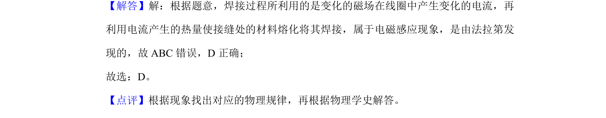

## 题面

## 摘要

该题考查焊接过程中利用的电磁感应现象及其发现者。

## 关联考点

- [[175-电磁感应|电磁感应]]
- [[482-物理学史|物理学史]]
- [[651-涡电流|涡电流]]

## 答案与解析

> 📄 原 PDF 第 1 页：`素材/真题/吉林/2008-2024·（吉林）物理高考真题/2020年高考物理试卷（新课标Ⅱ）（解析卷）.pdf`

<!-- 题干文本-start -->
## 题干文本
1． （6分）管道高频焊机可以对由钢板卷成的圆管的接缝实施焊接。焊机的原理如图所示，
圆管通过一个接有高频交流电源的线圈， 线圈所产生的交变磁场使圆管中产生交变电流，
电流产生的热量使接缝处的材料熔化将其焊接。焊接过程中所利用的电磁学规律的发现
者为（　　）
A．库仑B．霍尔C．洛伦兹D．法拉第
<!-- 题干文本-end -->

<!-- 解析文本-start -->
## 解析文本
【分析】由题意可知，圆管为金属导体，导体内部自成闭合回路，且有电阻，当周围的
线圈中产生出交变磁场时，就会在导体内部感应出涡电流，电流通过电阻要发热。该过
程利用的原理是电磁感应现象，其发现者为法拉第。
【解答】解：根据题意，焊接过程所利用的是变化的磁场在线圈中产生变化的电流，再
利用电流产生的热量使接缝处的材料熔化将其焊接，属于电磁感应现象，是由法拉第发
现的，故ABC错误，D正确；
故选：D。
【点评】根据现象找出对应的物理规律，再根据物理学史解答。
<!-- 解析文本-end -->
