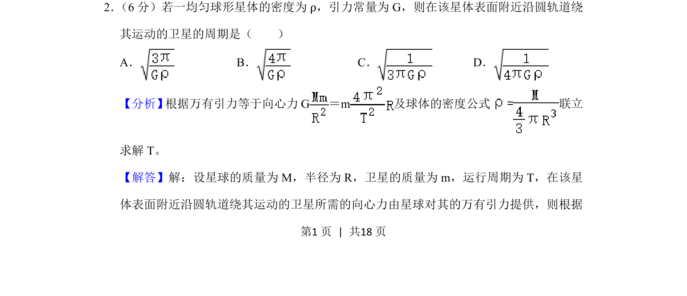

## 题面

## 摘要

该题通过万有引力提供向心力并结合密度公式，求解均匀球体表面附近卫星的环绕周期。

## 关联考点

- [[246-万有引力定律|万有引力定律]]
- [[向心力公式]]
- [[密度公式]]
- [[周期计算]]

## 答案与解析

> 📄 原 PDF 第 1 页：`素材/真题/吉林/2008-2024·（吉林）物理高考真题/2020年高考物理试卷（新课标Ⅱ）（解析卷）.pdf`
