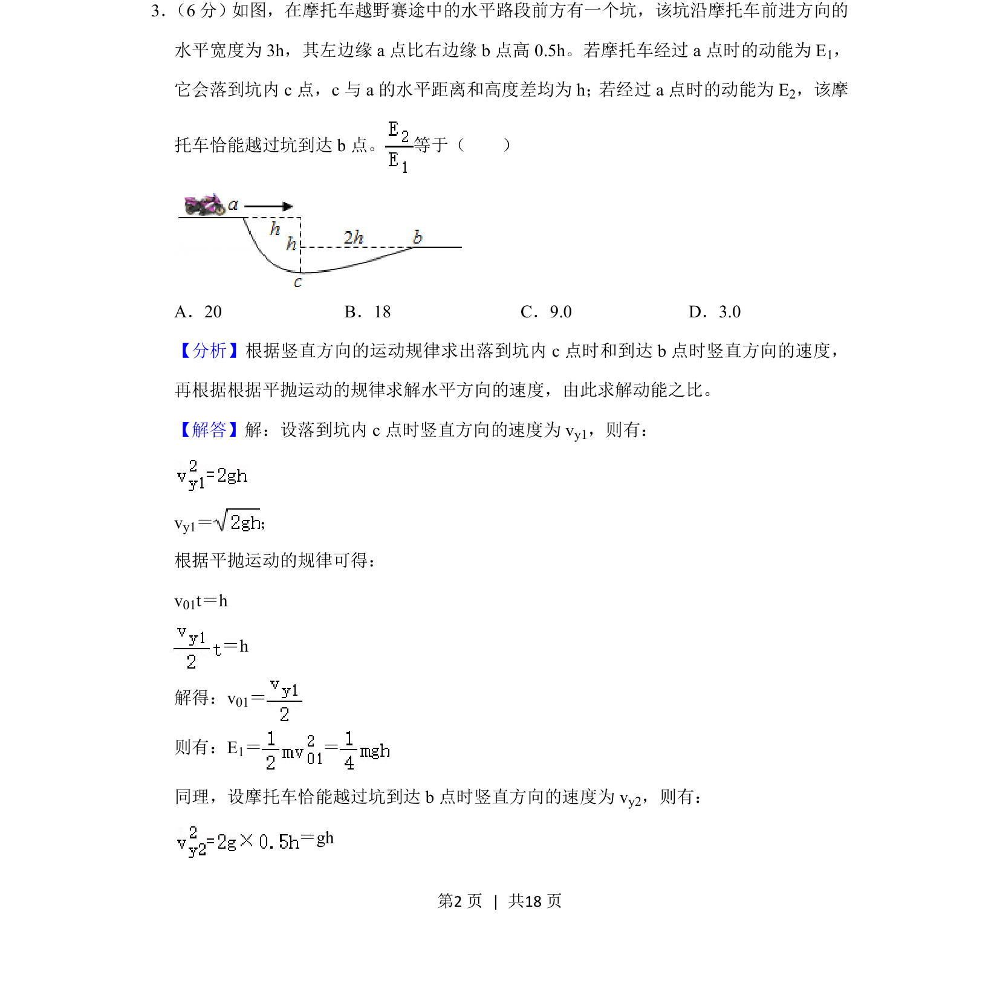
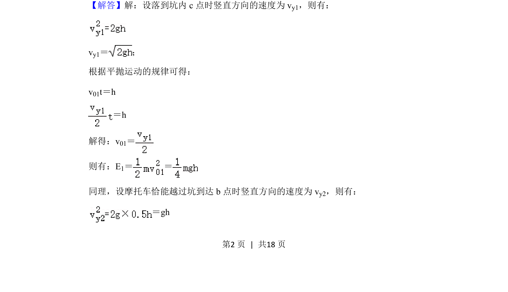
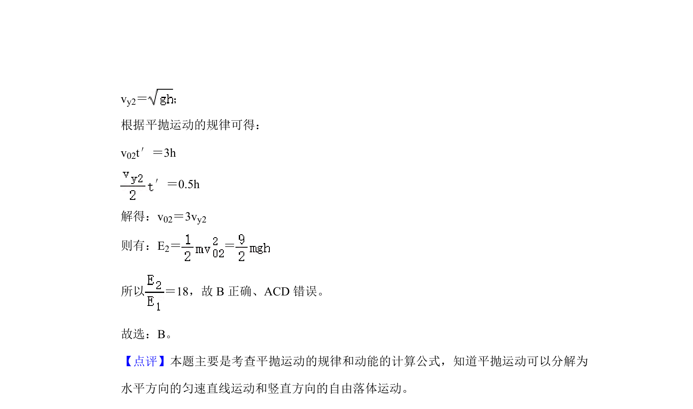

## 题面

## 摘要

该题考查平抛运动中水平与竖直分运动的规律及动能计算，结合几何关系求解动能之比。

## 关联考点

- [[261-平抛运动|平抛运动]]
- [[067-动能|动能]]
- [[731-运动分解|运动分解]]

## 答案与解析

> 📄 原 PDF 第 2 页：`素材/真题/吉林/2008-2024·（吉林）物理高考真题/2020年高考物理试卷（新课标Ⅱ）（解析卷）.pdf`
