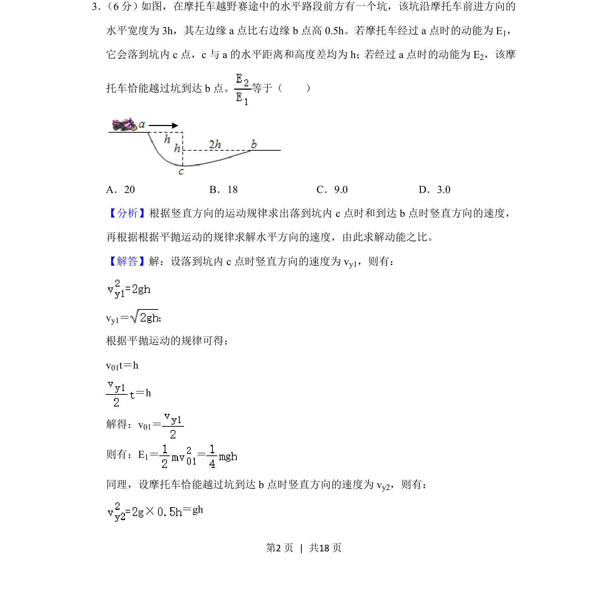
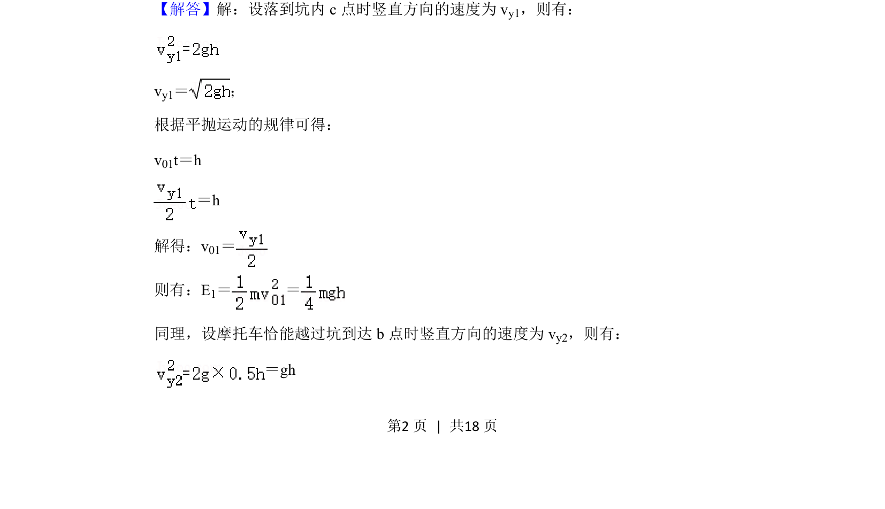
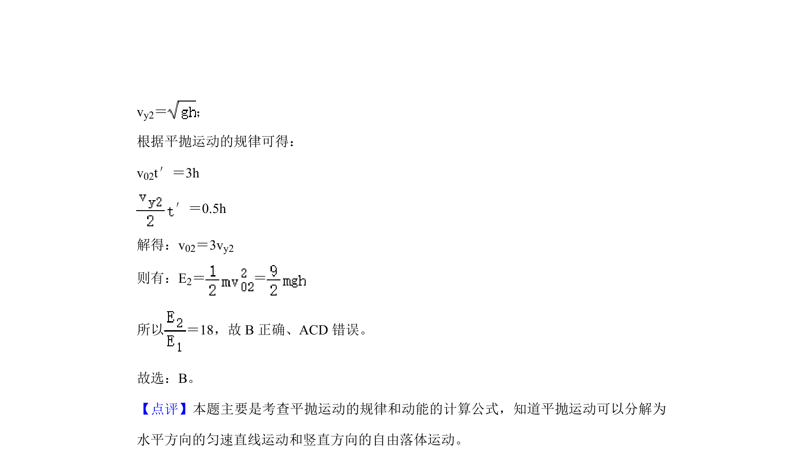

## 题面

## 摘要

该题考查平抛运动中水平与竖直分运动的规律及动能计算，结合几何关系求解动能之比。

## 关联考点

- [[261-平抛运动|平抛运动]]
- [[067-动能|动能]]
- [[731-运动分解|运动分解]]

## 答案与解析

> 📄 原 PDF 第 2 页：`素材/真题/吉林/2008-2024·（吉林）物理高考真题/2020年高考物理试卷（新课标Ⅱ）（解析卷）.pdf`

<!-- 题干文本-start -->
## 题干文本
3． （6分）如图，在摩托车越野赛途中的水平路段前方有一个坑，该坑沿摩托车前进方向的
水平宽度为3h，其左边缘a点比右边缘b点高0.5h。若摩托车经过a点时的动能为E 1，
它会落到坑内c点，c与a的水平距离和高度差均为h； 若经过a点时的动能为E 2，该摩
托车恰能越过坑到达b点。 等于（　　）
A．20 B．18 C．9.0 D．3.0
<!-- 题干文本-end -->

<!-- 解析文本-start -->
## 解析文本
【分析】根据竖直方向的运动规律求出落到坑内c点时和到达b点时竖直方向的速度，
再根据根据平抛运动的规律求解水平方向的速度，由此求解动能之比。
【解答】解：设落到坑内c点时竖直方向的速度为v y1，则有：
vy1＝ ；
根据平抛运动的规律可得：
v01t＝h
＝h
解得：v01＝
则有：E1＝ ＝
同理，设摩托车恰能越过坑到达b点时竖直方向的速度为v y2，则有：
＝gh
<!-- 解析文本-end -->
