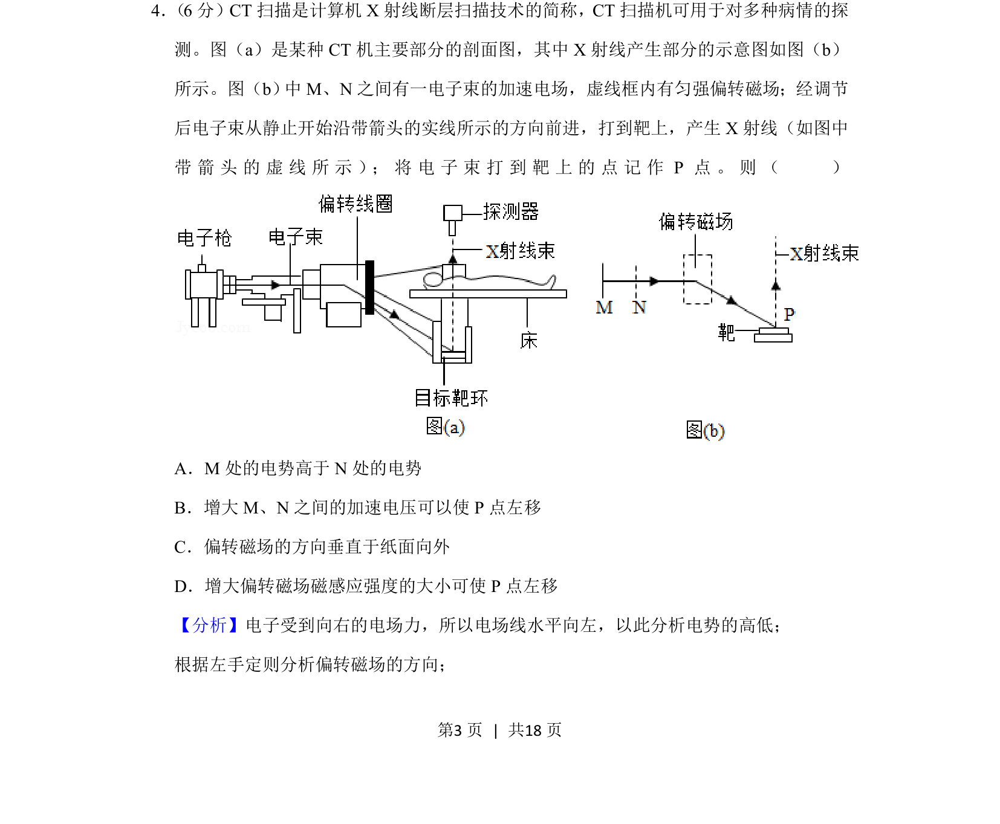
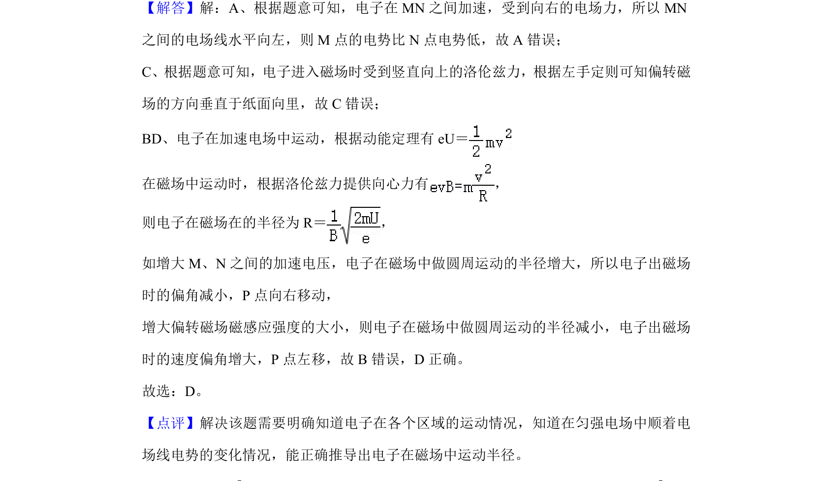

## 题面

## 摘要

电场加速与磁场偏转的综合分析，涉及电势高低和偏转方向判断。

## 关联考点

- [[594-带电粒子加速|带电粒子加速]]
- [[667-电势判断|电势判断]]
- [[297-安培力方向-左手定则|左手定则]]
- [[703-磁场偏转|磁场偏转]]

## 答案与解析

> 📄 原 PDF 第 3 页：`素材/真题/吉林/2008-2024·（吉林）物理高考真题/2020年高考物理试卷（新课标Ⅱ）（解析卷）.pdf`
