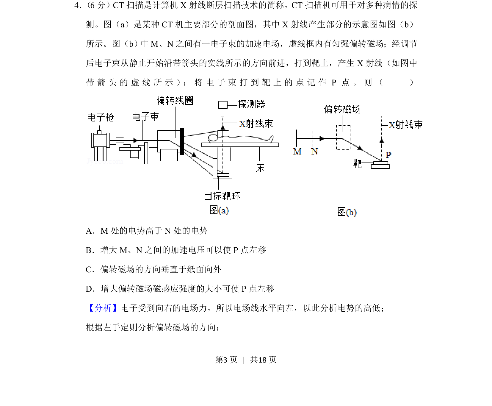
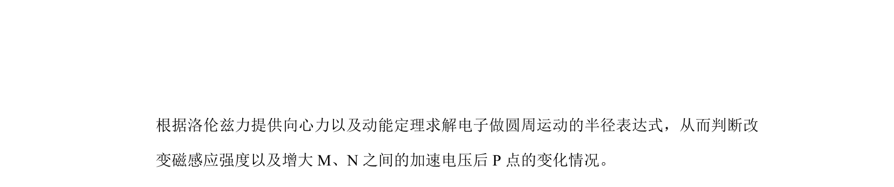
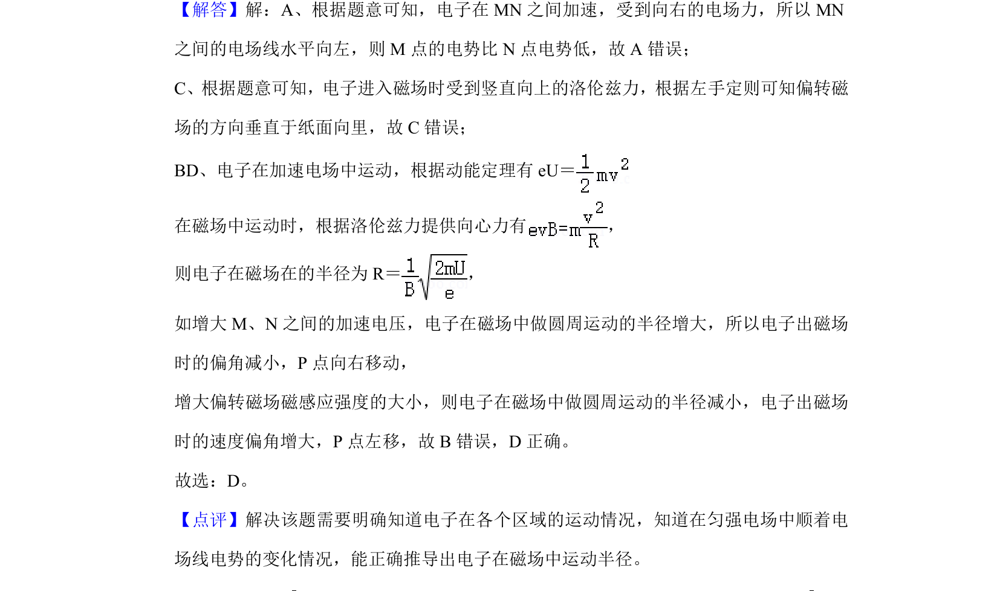

## 题面

## 摘要

电场加速与磁场偏转的综合分析，涉及电势高低和偏转方向判断。

## 关联考点

- [[594-带电粒子加速|带电粒子加速]]
- [[667-电势判断|电势判断]]
- [[297-安培力方向-左手定则|左手定则]]
- [[703-磁场偏转|磁场偏转]]

## 答案与解析

> 📄 原 PDF 第 3 页：`素材/真题/吉林/2008-2024·（吉林）物理高考真题/2020年高考物理试卷（新课标Ⅱ）（解析卷）.pdf`

<!-- 题干文本-start -->
## 题干文本
4． （6分）CT扫描是计算机X射线断层扫描技术的简称，CT扫描机可用于对多种病情的探
测。图（a）是某种CT机主要部分的剖面图，其中X射线产生部分的示意图如图（b）
所示。图（b） 中M、N之间有一电子束的加速电场，虚线框内有匀强偏转磁场；经调节
后电子束从静止开始沿带箭头的实线所示的方向前进，打到靶上，产生X射线（如图中
带 箭 头 的 虚 线 所 示 ）； 将 电 子 束 打 到 靶 上 的 点 记 作P点 。 则 （ 　 　 ）
A．M处的电势高于N处的电势
B．增大M、N之间的加速电压可以使P点左移
C．偏转磁场的方向垂直于纸面向外
D．增大偏转磁场磁感应强度的大小可使P点左移
<!-- 题干文本-end -->

<!-- 解析文本-start -->
## 解析文本
【分析】电子受到向右的电场力，所以电场线水平向左，以此分析电势的高低；
根据左手定则分析偏转磁场的方向；
<!-- 解析文本-end -->
