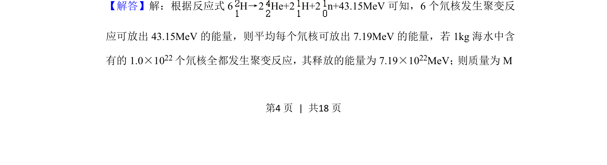
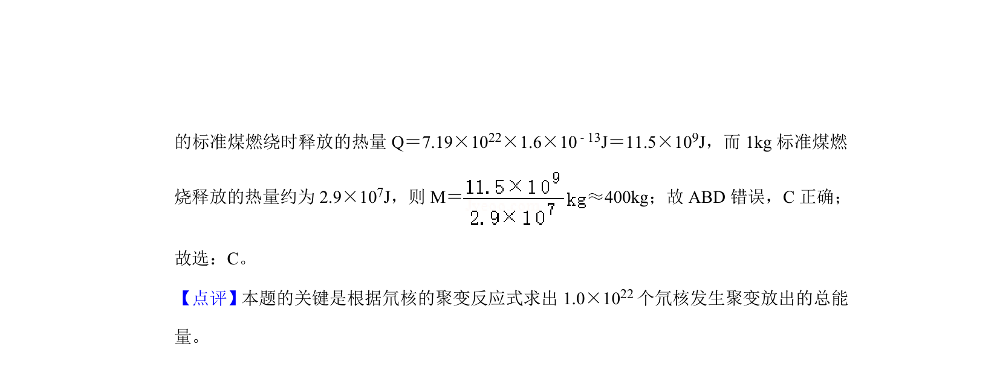

## 题面

## 摘要

计算海水氘核聚变释放能量与标准煤燃烧热量的等效质量。

## 关联考点

- [[140-核能|核聚变]]
- [[490-能量计算|能量计算]]
- [[547-单位换算|单位换算]]
- [[449-质能方程|质能方程]]

## 答案与解析

> 📄 原 PDF 第 4 页：`素材/真题/吉林/2008-2024·（吉林）物理高考真题/2020年高考物理试卷（新课标Ⅱ）（解析卷）.pdf`
