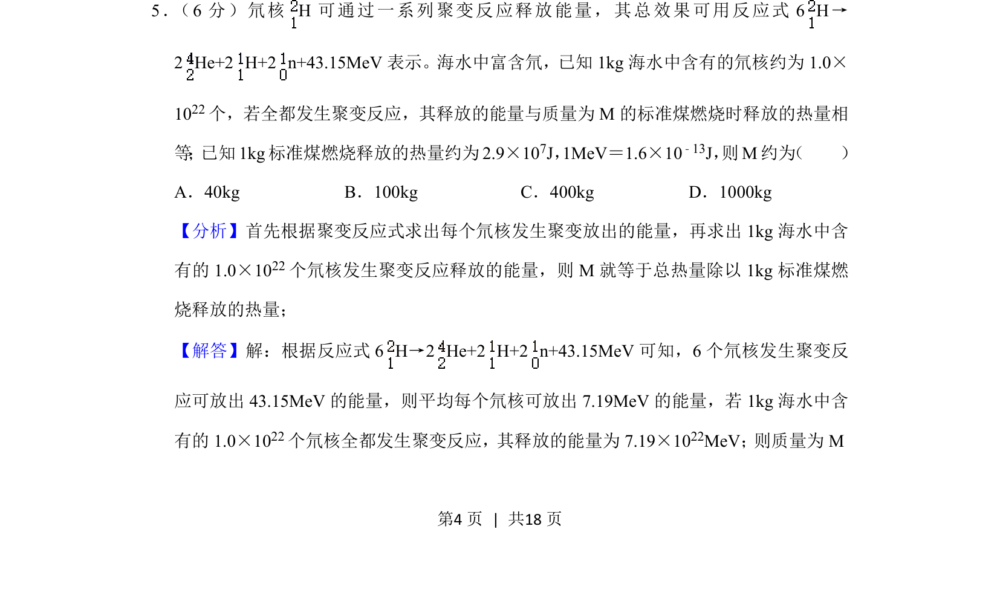

## 题面

## 摘要

该题考查利用聚变反应能量数据及单位换算计算标准煤质量，涉及大数运算与估算。

## 关联考点

- [[单位换算]]
- [[乘法运算]]
- [[521-科学记数法|科学记数法]]
- [[046-近似数|估算]]

## 答案与解析

> 📄 原 PDF 第 4 页：`素材/真题/吉林/2008-2024·（吉林）物理高考真题/2020年高考物理试卷（新课标Ⅱ）（解析卷）.pdf`
