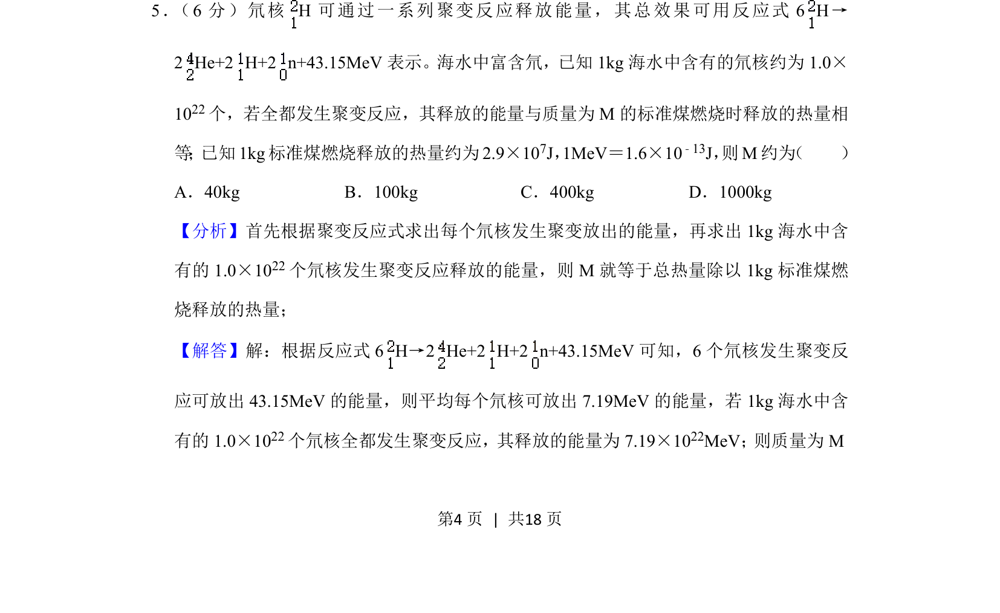
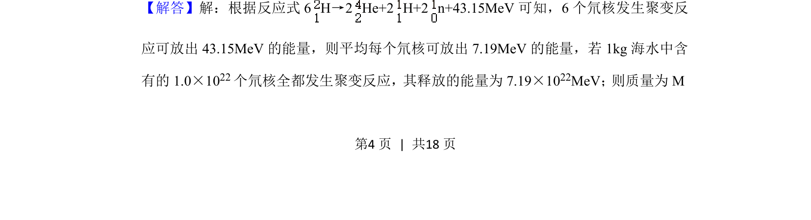
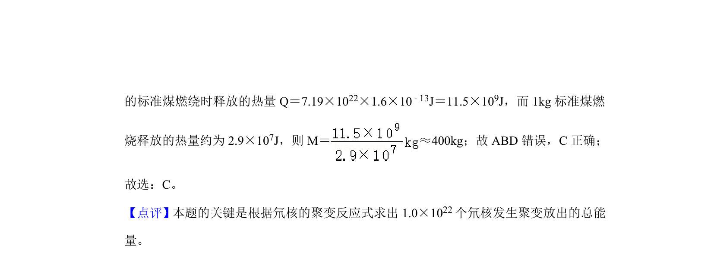

## 题面

## 摘要

计算海水氘核聚变释放能量与标准煤燃烧热量的等效质量。

## 关联考点

- [[140-核能|核聚变]]
- [[490-能量计算|能量计算]]
- [[547-单位换算|单位换算]]
- [[449-质能方程|质能方程]]

## 答案与解析

> 📄 原 PDF 第 4 页：`素材/真题/吉林/2008-2024·（吉林）物理高考真题/2020年高考物理试卷（新课标Ⅱ）（解析卷）.pdf`

<!-- 题干文本-start -->
## 题干文本
5． （6分）氘核H可通过一系列聚变反应释放能量，其总效果可用反应式6 H→
2 He+2 H+2 n+43.15MeV表示。海水中富含氘，已知1kg海水中含有的氘核约为1.0×
1022个，若全都发生聚变反应，其释放的能量与质量为M的标准煤燃烧时释放的热量相
等 ； 已知1kg标准煤燃烧释放的热量约为2.9×107J，1MeV＝1.6×10﹣13J， 则M约为 （　　）
A．40kg B．100kg C．400kg D．1000kg
<!-- 题干文本-end -->

<!-- 解析文本-start -->
## 解析文本
【分析】首先根据聚变反应式求出每个氘核发生聚变放出的能量，再求出1kg海水中含
有的1.0×10 22个氘核发生聚变反应释放的能量，则M就等于总热量除以1kg标准煤燃
烧释放的热量；
【解答】解：根据反应式6 H→2 He+2 H+2 n+43.15MeV可知，6个氘核发生聚变反
应可放出43.15MeV的能量，则平均每个氘核可放出7.19MeV的能量，若1kg海水中含
有的1.0×10 22个氘核全都发生聚变反应，其释放的能量为7.19×1022MeV； 则质量为M
<!-- 解析文本-end -->
