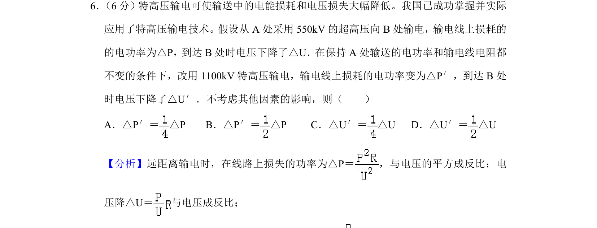
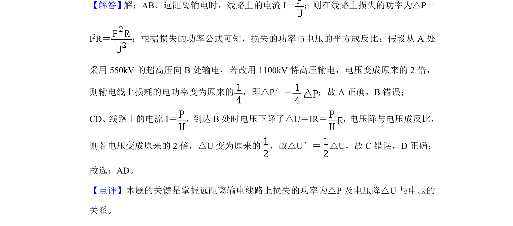

## 题面

## 摘要

特高压输电中，输电线上功率损耗和电压降与输电电压的关系判断。

## 关联考点

- [[414-远距离输电|远距离输电]]
- [[731-输电损耗|输电损耗]]
- [[670-电压降|电压降]]
- [[753-高压输电|高压输电]]

## 答案与解析

> 📄 原 PDF 第 5 页：`素材/真题/吉林/2008-2024·（吉林）物理高考真题/2020年高考物理试卷（新课标Ⅱ）（解析卷）.pdf`
